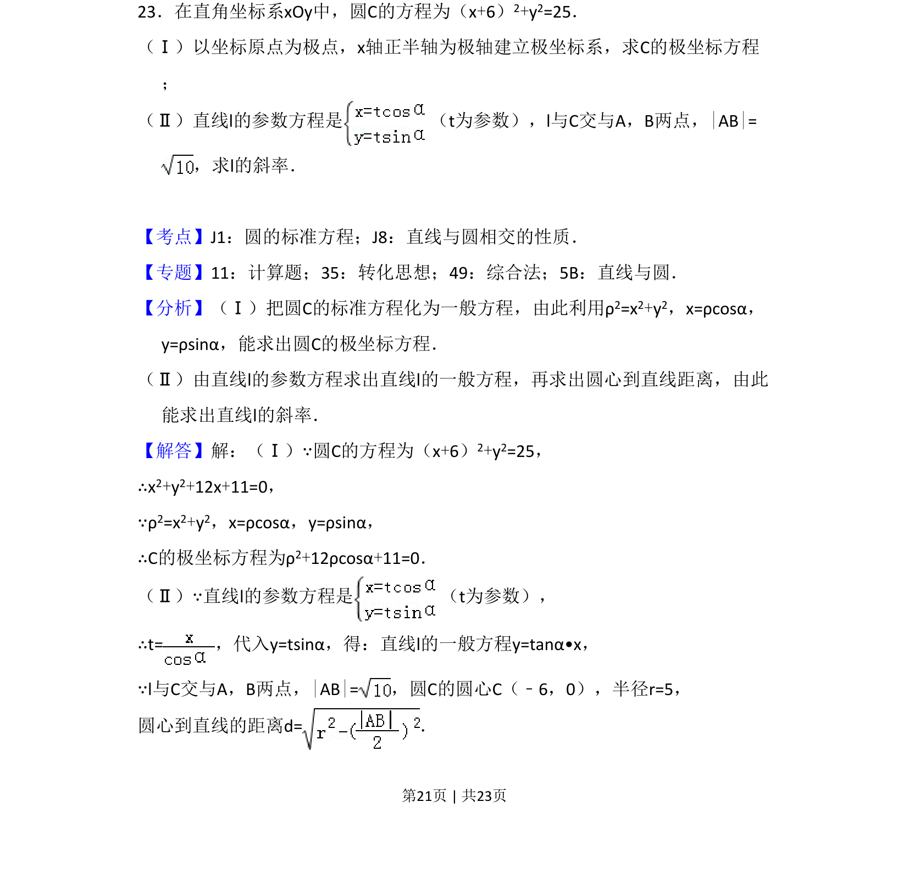

## 题面

## 摘要

将圆的直角坐标方程化为极坐标方程，通过直线参数方程求弦长进而求斜率。

## 关联考点

- [[373-圆的标准方程|圆的标准方程]]
- [[极坐标方程]]
- [[直线参数方程]]
- [[直线与圆相交的性质]]

## 答案与解析

> 📄 原 PDF 第 21 页：`素材/真题/吉林/2008-2024·（吉林）数学高考真题/2016年高考数学试卷（文）（新课标Ⅱ）（解析卷）.pdf`
