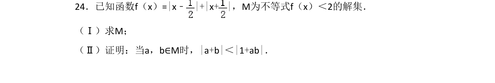
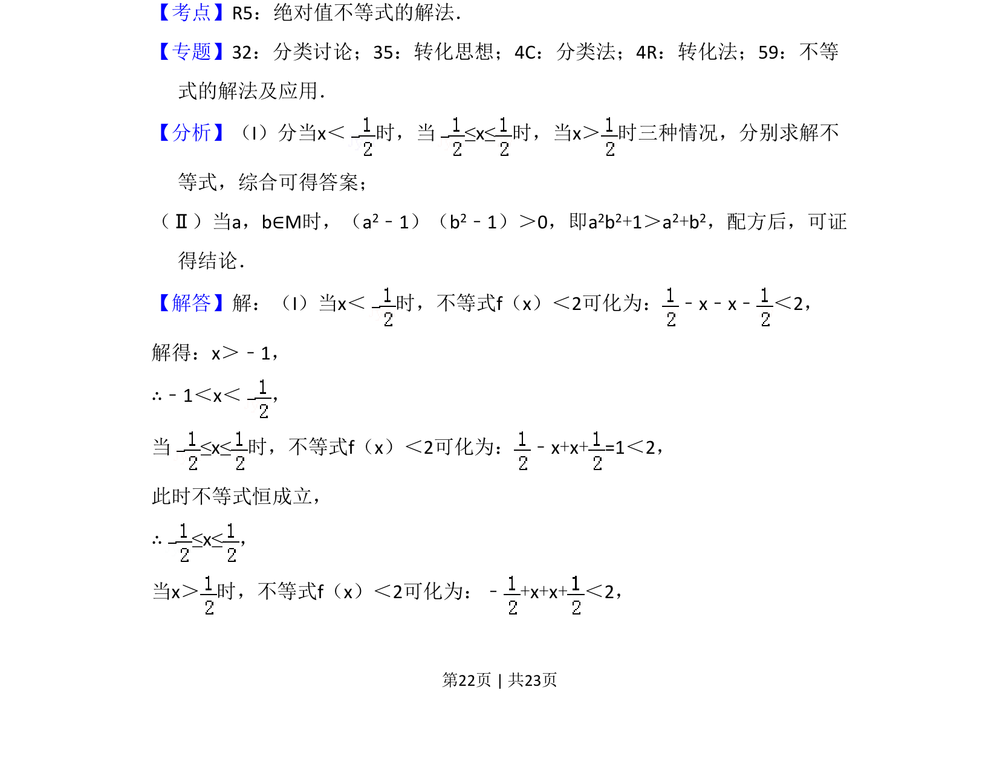
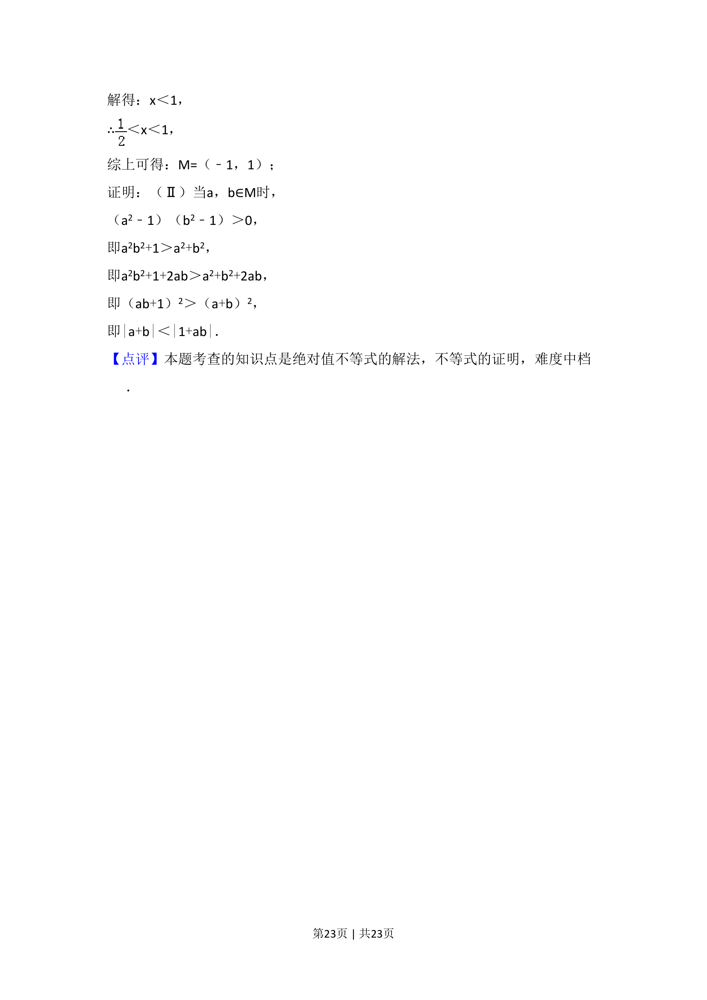

## 题面

## 摘要

求 f(x)=|x-1/2|+|x+1/2|≤6 的解集；并证明当 a,b∈M 时 |a+b|<|1+ab|。

## 关联考点

- [[1092-绝对值不等式|绝对值不等式]]
- [[424-参数分类讨论|分类讨论]]
- [[625-不等式证明|不等式证明]]

## 答案与解析

> 📄 原 PDF 第 22 页：`素材/真题/吉林/2008-2024·（吉林）数学高考真题/2016年高考数学试卷（文）（新课标Ⅱ）（解析卷）.pdf`
