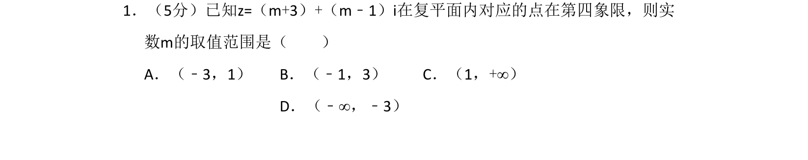
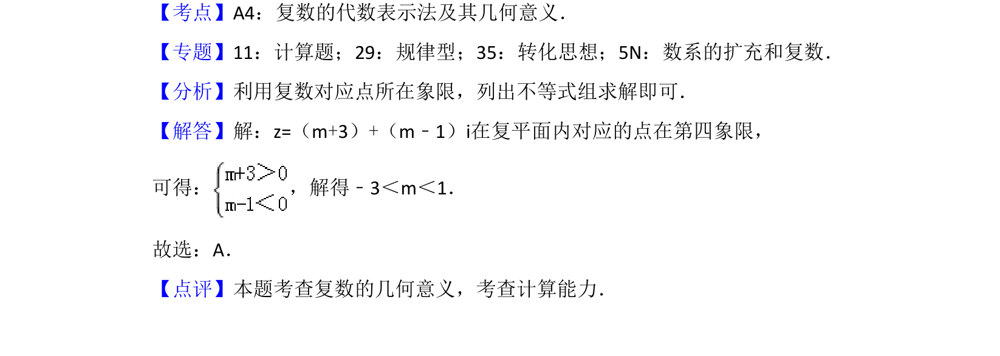

## 题面

## 摘要

已知复数代数形式，根据其在复平面内对应点所在象限求参数取值范围，涉及象限符号和解不等式组。

## 关联考点

- [[333-复数的几何意义|复数的几何意义]]
- [[1114-象限坐标符号|象限坐标符号]]
- [[1109-解不等式组|解不等式组]]

## 答案与解析

> 📄 原 PDF 第 1 页：`素材/真题/吉林/2008-2024·（吉林）数学高考真题/2016年高考数学试卷（理）（新课标Ⅱ）（解析卷）.pdf`
