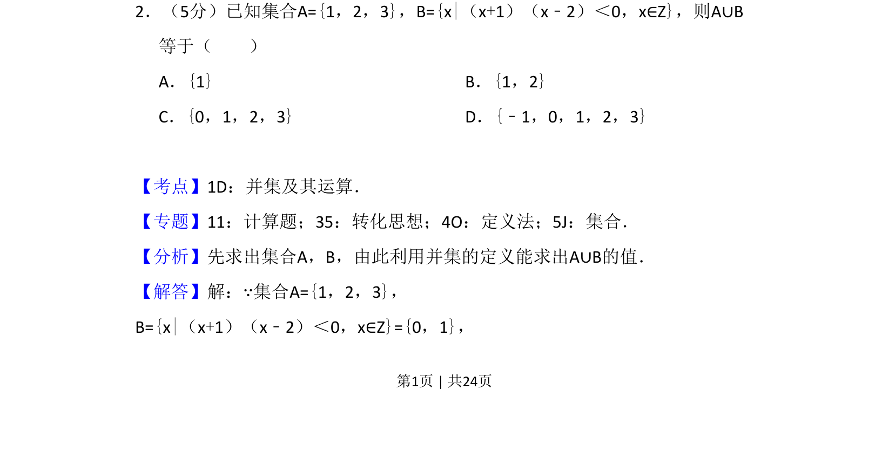
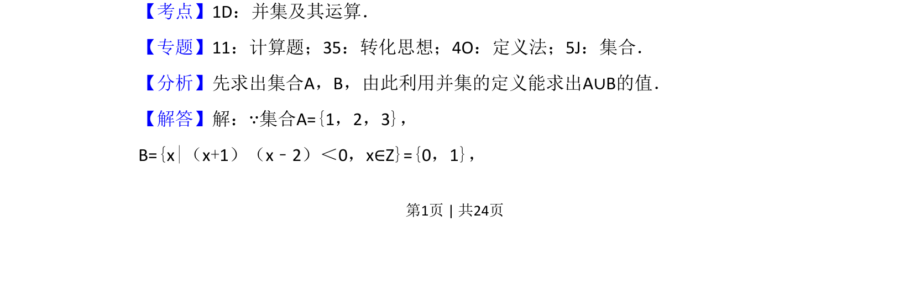
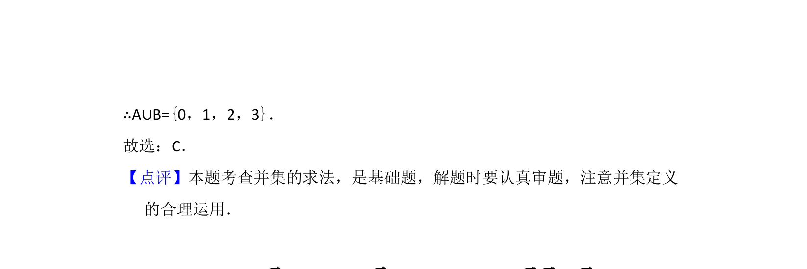

## 题面

## 摘要

该题考查集合的并集运算，需先解不等式确定集合B的元素。

## 关联考点

- [[1141-集合的表示法|集合的表示法]]
- [[267-一元二次不等式|一元二次不等式]]
- [[861-并集运算|并集运算]]

## 答案与解析

> 📄 原 PDF 第 1 页：`素材/真题/吉林/2008-2024·（吉林）数学高考真题/2016年高考数学试卷（理）（新课标Ⅱ）（解析卷）.pdf`
