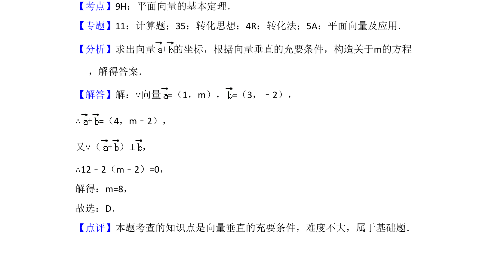

## 题面

## 摘要

本题给出两向量坐标，利用垂直关系建立方程求参数 m。

## 关联考点

- [[335-平面向量坐标运算|平面向量坐标运算]]
- [[746-向量垂直充要条件|向量垂直充要条件]]

## 答案与解析

> 📄 原 PDF 第 2 页：`素材/真题/吉林/2008-2024·（吉林）数学高考真题/2016年高考数学试卷（理）（新课标Ⅱ）（解析卷）.pdf`

<!-- 题干文本-start -->
## 题干文本
3．（5分）已知向量=（1，m），=（3，﹣2），且（+）⊥，则m=（　　
）
A．﹣8 B．﹣6 C．6 D．8
<!-- 题干文本-end -->

<!-- 解析文本-start -->
## 解析文本
【考点】9H：平面向量的基本定理．菁优网版权所有
【专题】11：计算题；35：转化思想；4R：转化法；5A：平面向量及应用．
【分析】求出向量+的坐标，根据向量垂直的充要条件，构造关于m的方程
，解得答案．
【解答】解：∵向量=（1，m），=（3，﹣2），
∴+=（4，m﹣2），
又∵（+）⊥，
∴12﹣2（m﹣2）=0，
解得：m=8，
故选：D．
【点评】本题考查的知识点是向量垂直的充要条件，难度不大，属于基础题．
<!-- 解析文本-end -->
