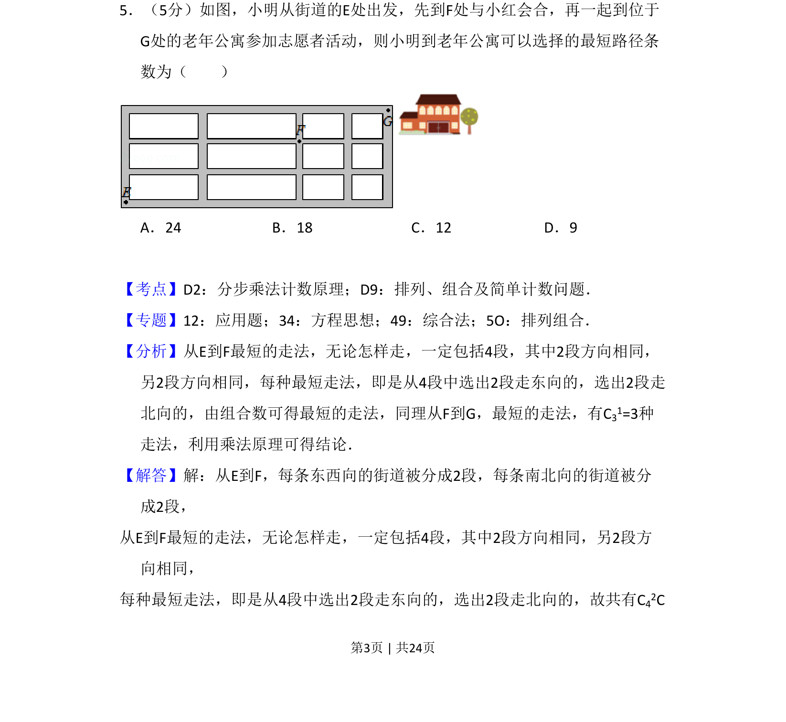

## 题面

## 摘要

小明从E到F再到G的最短路径问题，用组合数与分步乘法计数原理求解。

## 关联考点

- [[分步乘法计数原理]]
- [[487-排列概念|排列]]
- [[505-组合概念|组合]]

## 答案与解析

> 📄 原 PDF 第 3 页：`素材/真题/吉林/2008-2024·（吉林）数学高考真题/2016年高考数学试卷（理）（新课标Ⅱ）（解析卷）.pdf`
