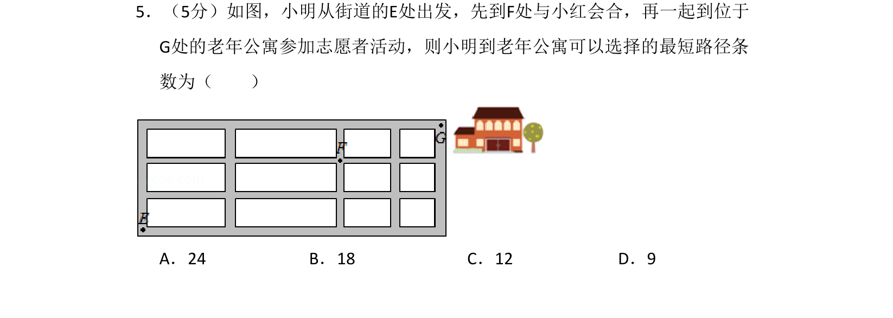
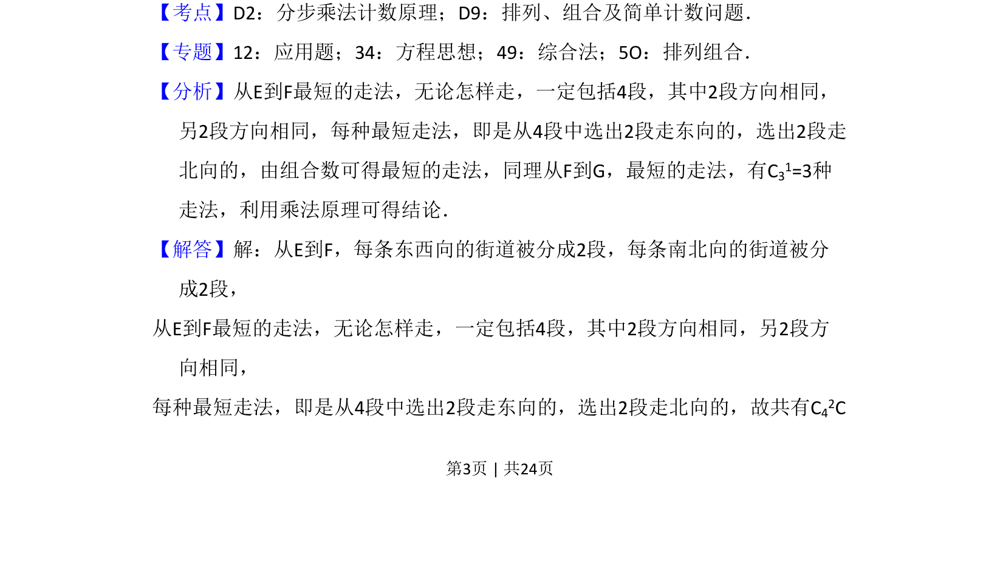
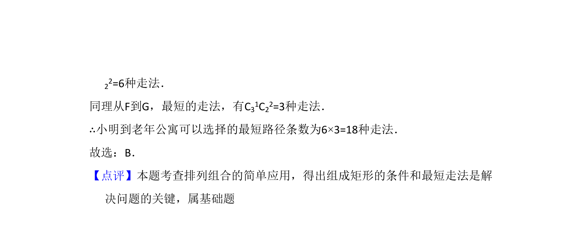

## 题面

## 摘要

小明从E到F再到G的最短路径问题，用组合数与分步乘法计数原理求解。

## 关联考点

- [[697-分步乘法计数原理|分步乘法计数原理]]
- [[487-排列概念|排列]]
- [[505-组合概念|组合]]

## 答案与解析

> 📄 原 PDF 第 3 页：`素材/真题/吉林/2008-2024·（吉林）数学高考真题/2016年高考数学试卷（理）（新课标Ⅱ）（解析卷）.pdf`

<!-- 题干文本-start -->
## 题干文本
5．（5分）如图，小明从街道的E处出发，先到F处与小红会合，再一起到位于
G处的老年公寓参加志愿者活动，则小明到老年公寓可以选择的最短路径条
数为（　　）
A．24 B．18 C．12 D．9
<!-- 题干文本-end -->

<!-- 解析文本-start -->
## 解析文本
【考点】D2：分步乘法计数原理；D9：排列、组合及简单计数问题．菁优网版权所有
【专题】12：应用题；34：方程思想；49：综合法；5O：排列组合．
【分析】从E到F最短的走法，无论怎样走，一定包括4段，其中2段方向相同，
另2段方向相同，每种最短走法，即是从4段中选出2段走东向的，选出2段走
北向的，由组合数可得最短的走法，同理从F到G，最短的走法，有C31=3种
走法，利用乘法原理可得结论．
【解答】解：从E到F，每条东西向的街道被分成2段，每条南北向的街道被分
成2段，
从E到F最短的走法，无论怎样走，一定包括4段，其中2段方向相同，另2段方
向相同，
每种最短走法，即是从4段中选出2段走东向的，选出2段走北向的，故共有C42C
<!-- 解析文本-end -->
