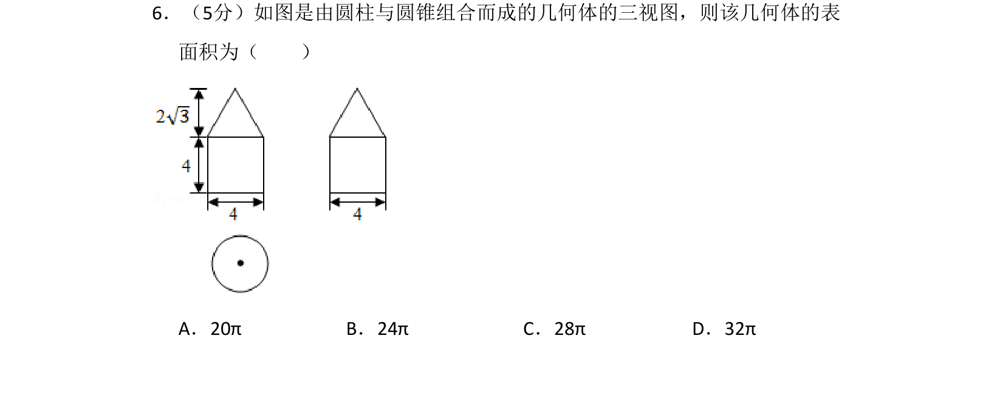
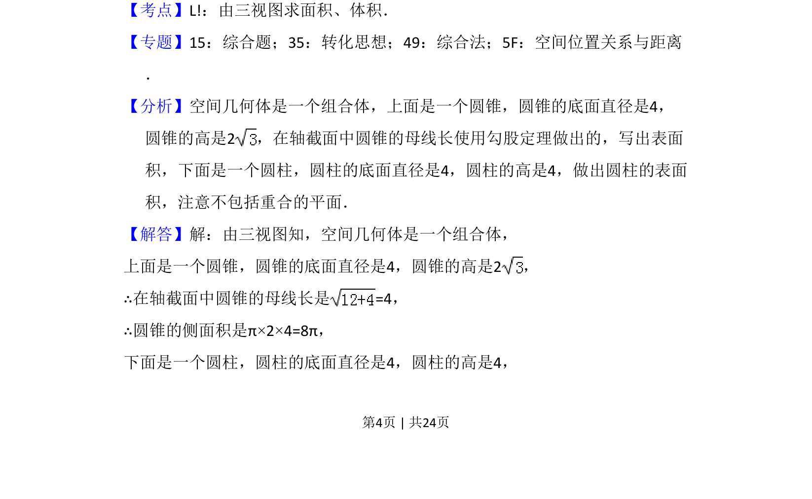
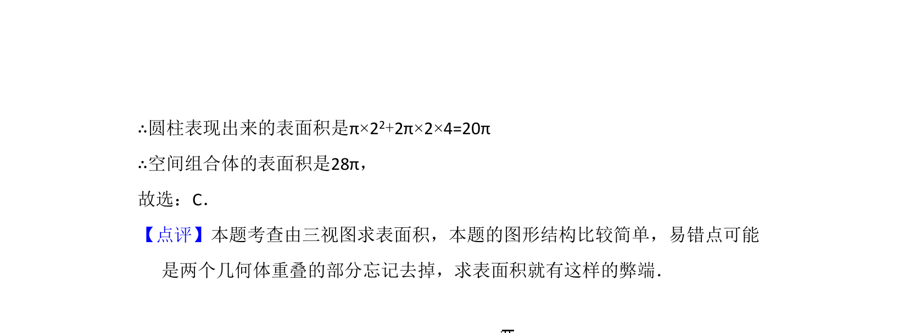

## 题面

## 摘要

根据三视图计算圆柱和圆锥组合体的表面积，需注意重合面不计入。

## 关联考点

- [[235-三视图|三视图]]
- [[065-表面积|表面积]]
- [[1204-组合体|组合体]]
- [[783-圆锥侧面积|圆锥侧面积]]

## 答案与解析

> 📄 原 PDF 第 4 页：`素材/真题/吉林/2008-2024·（吉林）数学高考真题/2016年高考数学试卷（理）（新课标Ⅱ）（解析卷）.pdf`
