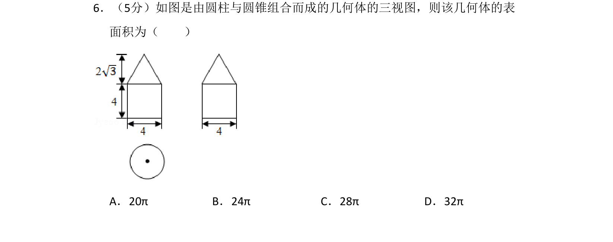
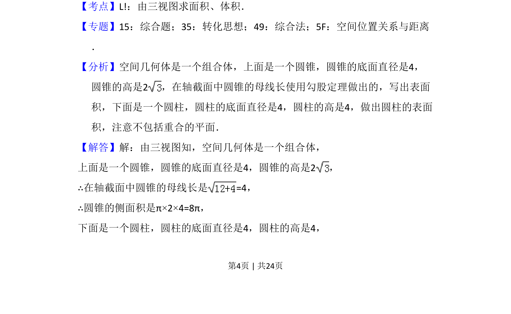
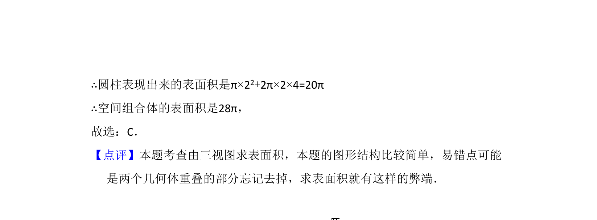

## 题面

## 摘要

根据三视图计算圆柱和圆锥组合体的表面积，需注意重合面不计入。

## 关联考点

- [[235-三视图|三视图]]
- [[065-表面积|表面积]]
- [[1203-组合体|组合体]]
- [[783-圆锥侧面积|圆锥侧面积]]

## 答案与解析

> 📄 原 PDF 第 4 页：`素材/真题/吉林/2008-2024·（吉林）数学高考真题/2016年高考数学试卷（理）（新课标Ⅱ）（解析卷）.pdf`

<!-- 题干文本-start -->
## 题干文本
6．（5分）如图是由圆柱与圆锥组合而成的几何体的三视图，则该几何体的表
面积为（　　）
A．20πB．24πC．28πD．32π
<!-- 题干文本-end -->

<!-- 解析文本-start -->
## 解析文本
【考点】L!：由三视图求面积、体积．菁优网版权所有
【专题】15：综合题；35：转化思想；49：综合法；5F：空间位置关系与距离
．
【分析】空间几何体是一个组合体，上面是一个圆锥，圆锥的底面直径是4，
圆锥的高是2，在轴截面中圆锥的母线长使用勾股定理做出的，写出表面
积，下面是一个圆柱，圆柱的底面直径是4，圆柱的高是4，做出圆柱的表面
积，注意不包括重合的平面．
【解答】解：由三视图知，空间几何体是一个组合体，
上面是一个圆锥，圆锥的底面直径是4，圆锥的高是2，
∴在轴截面中圆锥的母线长是=4，
∴圆锥的侧面积是π×2×4=8π，
下面是一个圆柱，圆柱的底面直径是4，圆柱的高是4，
<!-- 解析文本-end -->
