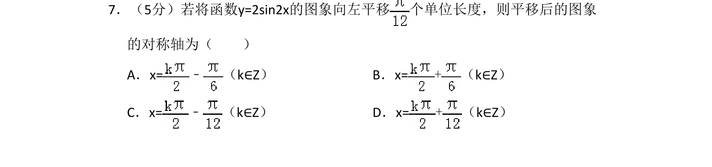
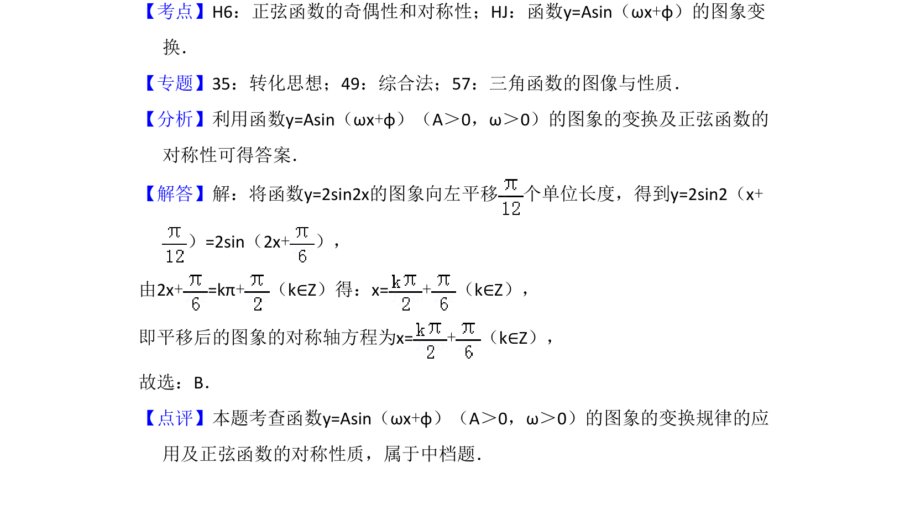

## 题面

## 摘要

该题考查三角函数图象平移变换及正弦函数的对称轴求解。

## 关联考点

- [[673-函数y=Asin(ωx+φ)的图象变换|函数y=Asin(ωx+φ)的图象变换]]
- [[567-正弦函数的对称性|正弦函数的对称性]]

## 答案与解析

> 📄 原 PDF 第 5 页：`素材/真题/吉林/2008-2024·（吉林）数学高考真题/2016年高考数学试卷（理）（新课标Ⅱ）（解析卷）.pdf`
