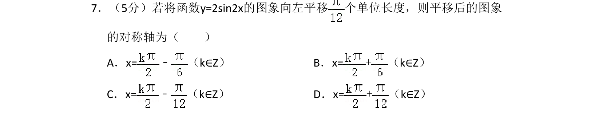
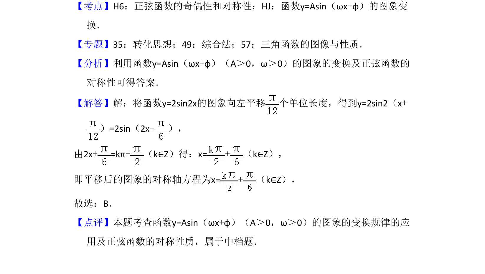

## 题面

## 摘要

该题考查三角函数图象平移变换及正弦函数的对称轴求解。

## 关联考点

- [[673-函数y=Asin(ωx+φ)的图象变换|函数y=Asin(ωx+φ)的图象变换]]
- [[567-正弦函数的对称性|正弦函数的对称性]]

## 答案与解析

> 📄 原 PDF 第 5 页：`素材/真题/吉林/2008-2024·（吉林）数学高考真题/2016年高考数学试卷（理）（新课标Ⅱ）（解析卷）.pdf`

<!-- 题干文本-start -->
## 题干文本
7．（5分）若将函数y=2sin2x的图象向左平移 个单位长度，则平移后的图象
的对称轴为（　　）
A．x=﹣ （k∈Z）B．x=+（k∈Z）
C．x=﹣ （k∈Z）D．x=+（k∈Z）
<!-- 题干文本-end -->

<!-- 解析文本-start -->
## 解析文本
【考点】H6：正弦函数的奇偶性和对称性；HJ：函数y=Asin（ωx+φ）的图象变
换．菁优网版权所有
【专题】35：转化思想；49：综合法；57：三角函数的图像与性质．
【分析】利用函数y=Asin（ωx+φ）（A＞0，ω＞0）的图象的变换及正弦函数的
对称性可得答案．
【解答】解：将函数y=2sin2x的图象向左平移 个单位长度，得到y=2sin2（x+
）=2sin（2x+），
由2x+=kπ+（k∈Z）得：x=+（k∈Z），
即平移后的图象的对称轴方程为x=+（k∈Z），
故选：B．
【点评】本题考查函数y=Asin（ωx+φ）（A＞0，ω＞0）的图象的变换规律的应
用及正弦函数的对称性质，属于中档题．
<!-- 解析文本-end -->
