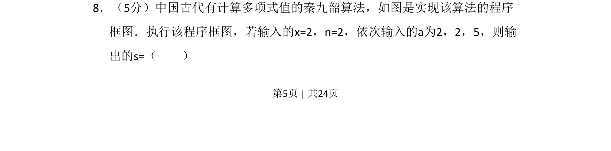
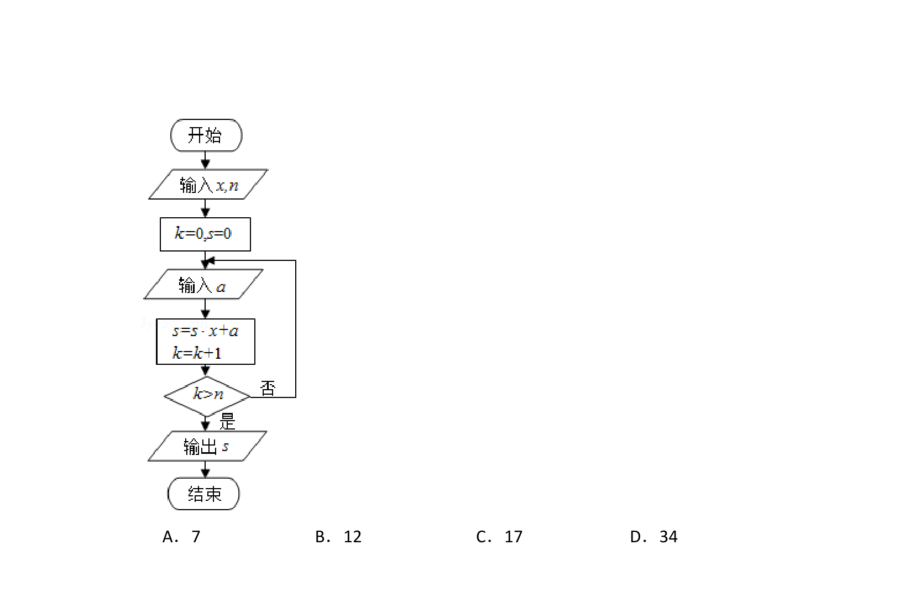
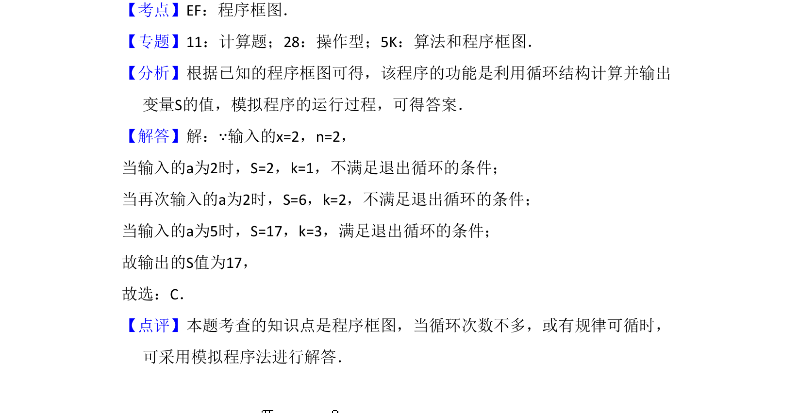

## 题面

## 摘要

通过程序框图考查秦九韶算法求多项式值的过程

## 关联考点

- [[1041-秦九韶算法|秦九韶算法]]
- [[1042-程序框图|程序框图]]
- [[870-循环结构|循环结构]]

## 答案与解析

> 📄 原 PDF 第 5 页：`素材/真题/吉林/2008-2024·（吉林）数学高考真题/2016年高考数学试卷（理）（新课标Ⅱ）（解析卷）.pdf`
