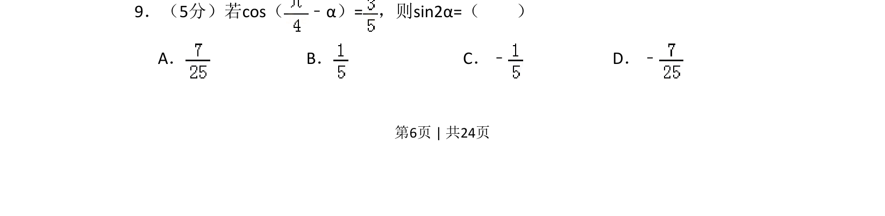

## 题面

## 摘要

本题给出 cos(π/4 – α) 的值，求 sin2α，考查诱导公式与二倍角公式的应用。

## 关联考点

- [[312-诱导公式|诱导公式]]
- [[二倍角公式]]
- [[272-三角恒等变换|三角恒等变换]]

## 答案与解析

> 📄 原 PDF 第 6 页：`素材/真题/吉林/2008-2024·（吉林）数学高考真题/2016年高考数学试卷（理）（新课标Ⅱ）（解析卷）.pdf`
