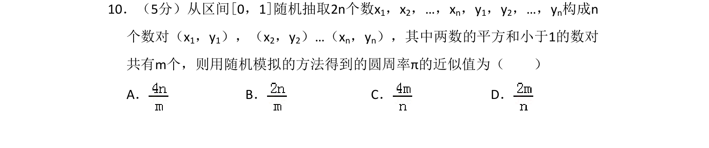
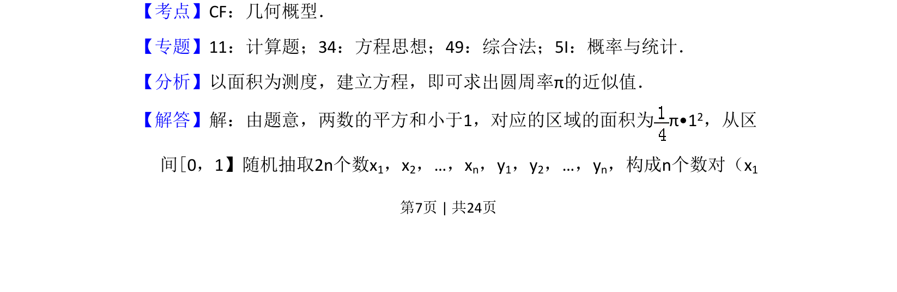
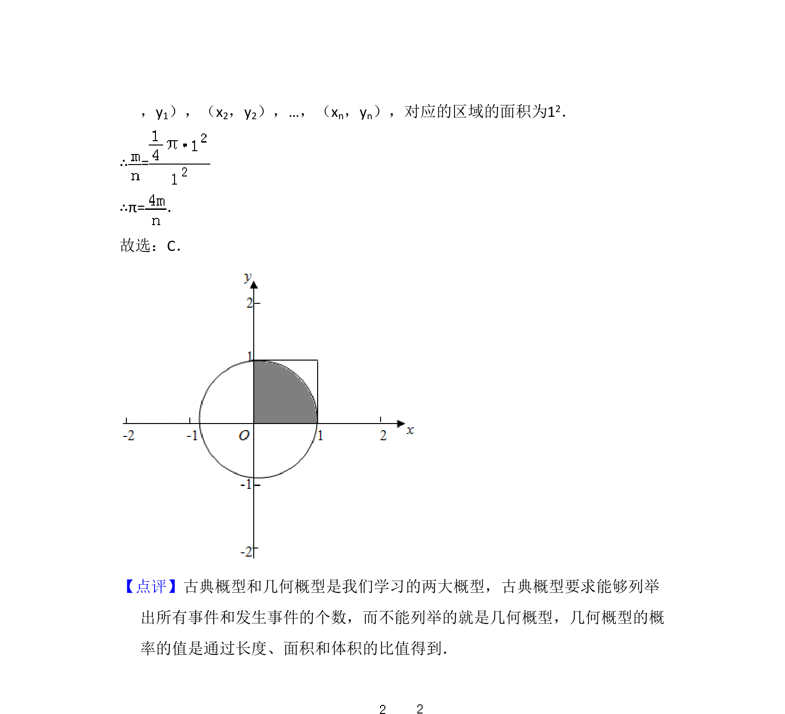

## 题面

## 摘要

利用随机模拟和面积比，通过几何概型求圆周率π的近似值。

## 关联考点

- [[667-几何概型|几何概型]]
- [[596-随机模拟|随机模拟]]
- [[1146-面积比|面积比]]

## 答案与解析

> 📄 原 PDF 第 7 页：`素材/真题/吉林/2008-2024·（吉林）数学高考真题/2016年高考数学试卷（理）（新课标Ⅱ）（解析卷）.pdf`
