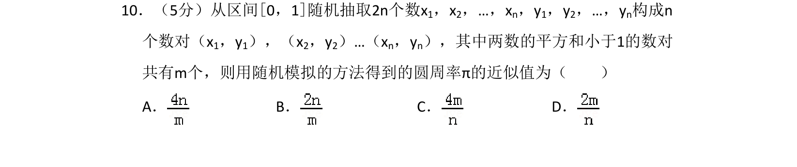
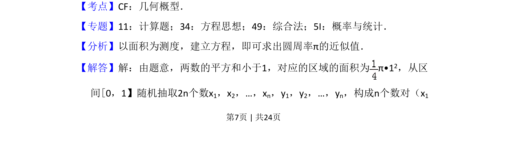
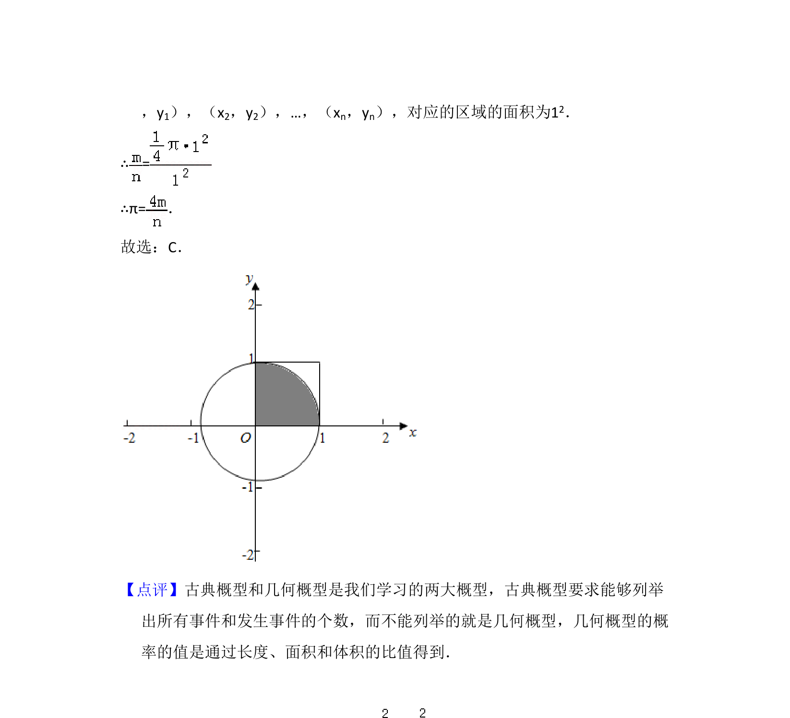

## 题面

## 摘要

利用随机模拟和面积比，通过几何概型求圆周率π的近似值。

## 关联考点

- [[667-几何概型|几何概型]]
- [[596-随机模拟|随机模拟]]
- [[1145-面积比|面积比]]

## 答案与解析

> 📄 原 PDF 第 7 页：`素材/真题/吉林/2008-2024·（吉林）数学高考真题/2016年高考数学试卷（理）（新课标Ⅱ）（解析卷）.pdf`

<!-- 题干文本-start -->
## 题干文本
10．（5分）从区间[0，1]随机抽取2n个数x1，x2，…，xn，y1，y2，…，yn构成n
个数对（x1，y1），（x2，y2）…（xn，yn），其中两数的平方和小于1的数对
共有m个，则用随机模拟的方法得到的圆周率π的近似值为（　　）
A．B．C．D．
<!-- 题干文本-end -->

<!-- 解析文本-start -->
## 解析文本
【考点】CF：几何概型．菁优网版权所有
【专题】11：计算题；34：方程思想；49：综合法；5I：概率与统计．
【分析】以面积为测度，建立方程，即可求出圆周率π的近似值．
【解答】解：由题意，两数的平方和小于1，对应的区域的面积为π•1 2，从区
间[0，1】随机抽取2n个数x1，x2，…，xn，y1，y2，…，yn，构成n个数对（x1
<!-- 解析文本-end -->
