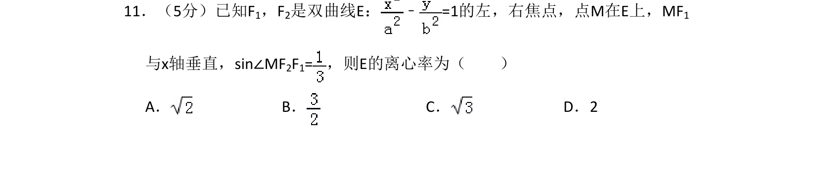
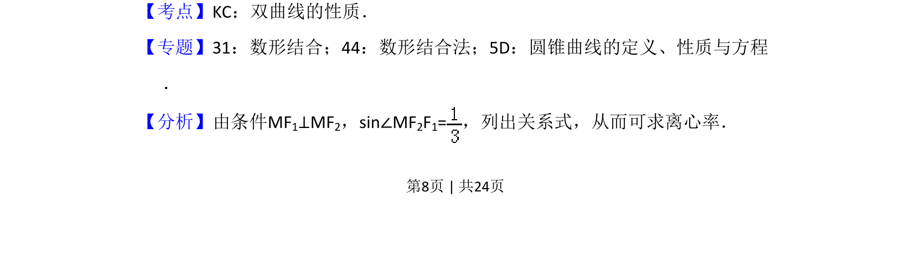
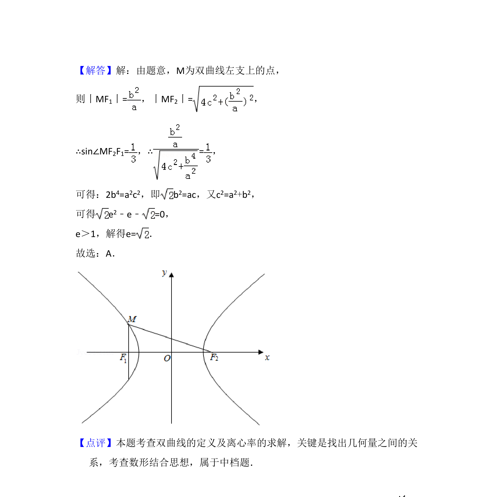

## 题面

## 摘要

已知双曲线的焦点和垂直条件及正弦值，求离心率。

## 关联考点

- [[731-双曲线的性质|双曲线的性质]]
- [[391-椭圆离心率|离心率]]
- [[897-数形结合|数形结合]]

## 答案与解析

> 📄 原 PDF 第 8 页：`素材/真题/吉林/2008-2024·（吉林）数学高考真题/2016年高考数学试卷（理）（新课标Ⅱ）（解析卷）.pdf`

<!-- 题干文本-start -->
## 题干文本
11．（5分）已知F1，F2是双曲线E： ﹣=1的左，右焦点，点M在E上，MF 1
与x轴垂直，sin∠MF2F1=，则E的离心率为（　　）
A．B．C．D．2
<!-- 题干文本-end -->

<!-- 解析文本-start -->
## 解析文本
【考点】KC：双曲线的性质．菁优网版权所有
【专题】31：数形结合；44：数形结合法；5D：圆锥曲线的定义、性质与方程
．
【分析】由条件MF1⊥MF2，sin∠MF2F1=，列出关系式，从而可求离心率．
<!-- 解析文本-end -->
