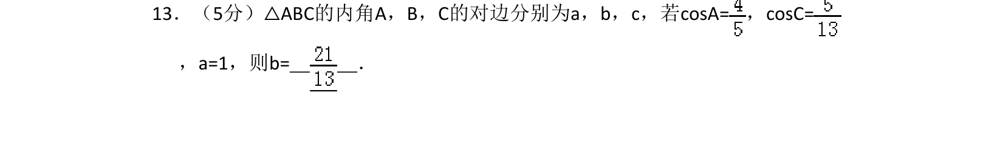
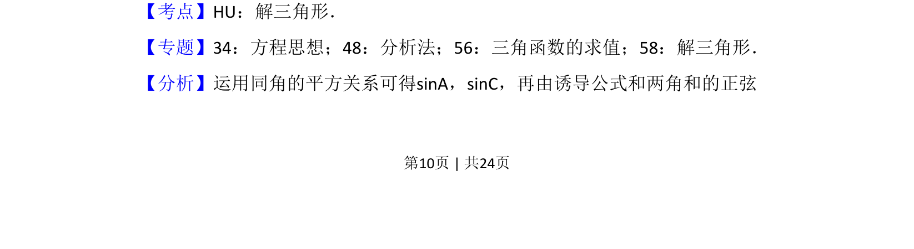
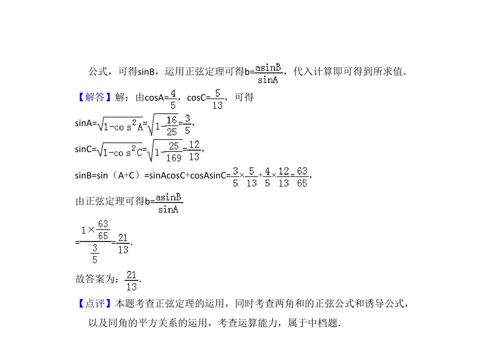

## 题面

## 摘要

已知两角余弦和一边，求另一边，需用同角平方关系求正弦，再通过诱导公式与正弦定理求解。

## 关联考点

- [[1155-平方关系|同角三角函数平方关系]]
- [[634-两角和的正弦公式|两角和的正弦公式]]
- [[126-定理|正弦定理]]
- [[589-解三角形|解三角形]]

## 答案与解析

> 📄 原 PDF 第 10 页：`素材/真题/吉林/2008-2024·（吉林）数学高考真题/2016年高考数学试卷（理）（新课标Ⅱ）（解析卷）.pdf`
