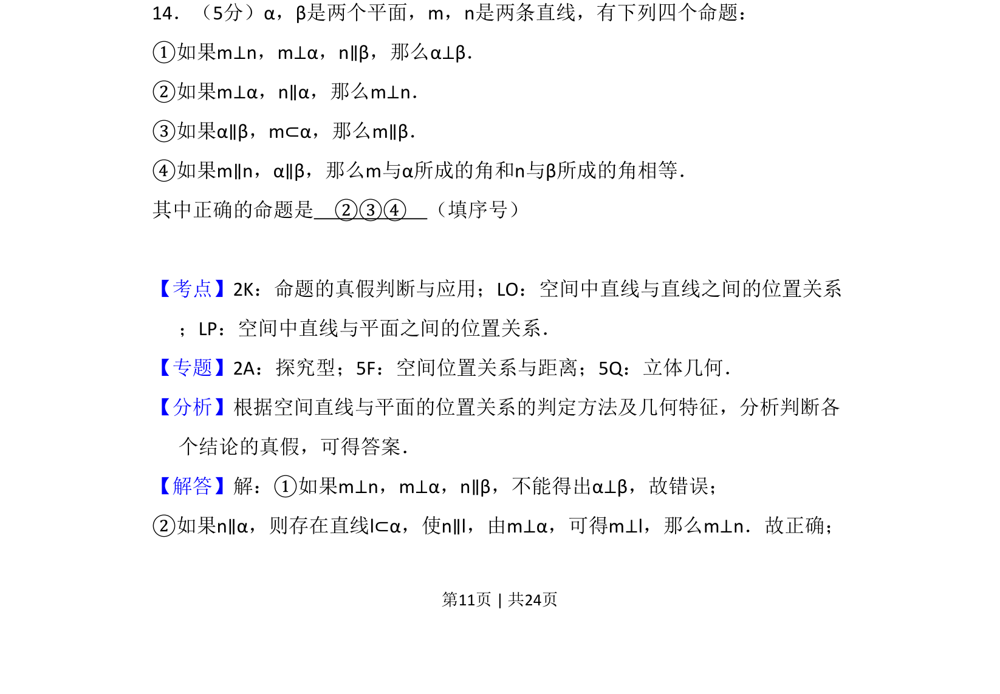
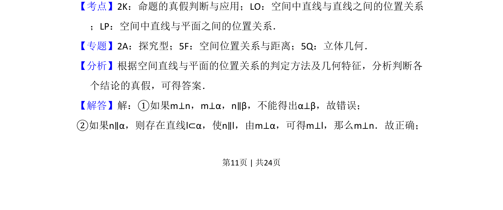
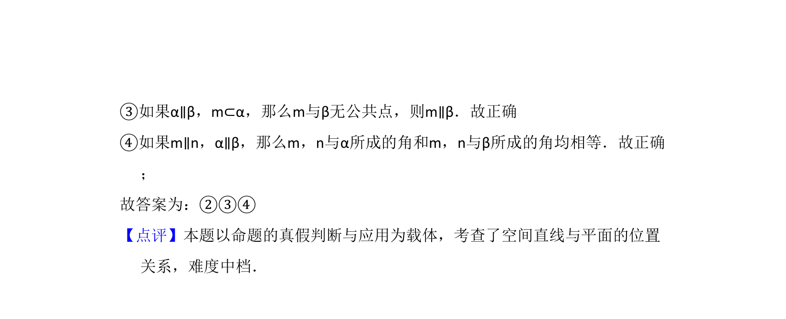

## 题面

## 摘要

该题考查空间线面平行垂直关系及命题真假判断。

## 关联考点

- [[1044-空间中直线与平面之间的位置关系|空间中直线与平面之间的位置关系]]
- [[764-命题的真假判断与应用|命题的真假判断与应用]]

## 答案与解析

> 📄 原 PDF 第 11 页：`素材/真题/吉林/2008-2024·（吉林）数学高考真题/2016年高考数学试卷（理）（新课标Ⅱ）（解析卷）.pdf`
