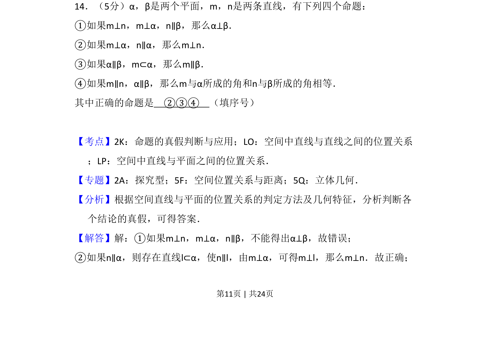
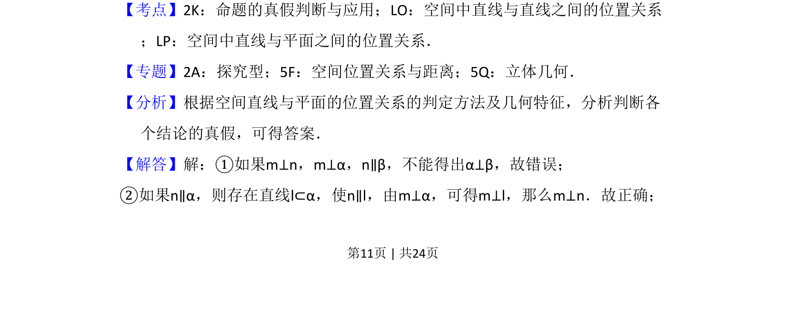
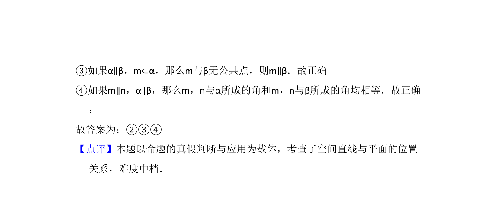

## 题面

## 摘要

该题考查空间线面平行垂直关系及命题真假判断。

## 关联考点

- [[1043-空间中直线与平面之间的位置关系|空间中直线与平面之间的位置关系]]
- [[764-命题的真假判断与应用|命题的真假判断与应用]]

## 答案与解析

> 📄 原 PDF 第 11 页：`素材/真题/吉林/2008-2024·（吉林）数学高考真题/2016年高考数学试卷（理）（新课标Ⅱ）（解析卷）.pdf`

<!-- 题干文本-start -->
## 题干文本
14．（5分）α，β是两个平面，m，n是两条直线，有下列四个命题：
①如果m⊥n，m⊥α，n∥β，那么α⊥β．
②如果m⊥α，n∥α，那么m⊥n．
③如果α∥β，m⊂α，那么m∥β．
④如果m∥n，α∥β，那么m与α所成的角和n与β所成的角相等．
其中正确的命题是　②③④　（填序号）
<!-- 题干文本-end -->

<!-- 解析文本-start -->
## 解析文本
【考点】2K：命题的真假判断与应用；LO：空间中直线与直线之间的位置关系
；LP：空间中直线与平面之间的位置关系．菁优网版权所有
【专题】2A：探究型；5F：空间位置关系与距离；5Q：立体几何．
【分析】根据空间直线与平面的位置关系的判定方法及几何特征，分析判断各
个结论的真假，可得答案．
【解答】解：①如果m⊥n，m⊥α，n∥β，不能得出α⊥β，故错误；
②如果n∥α，则存在直线l⊂α，使n∥l，由m⊥α，可得m⊥l，那么m⊥n．故正确；
<!-- 解析文本-end -->
