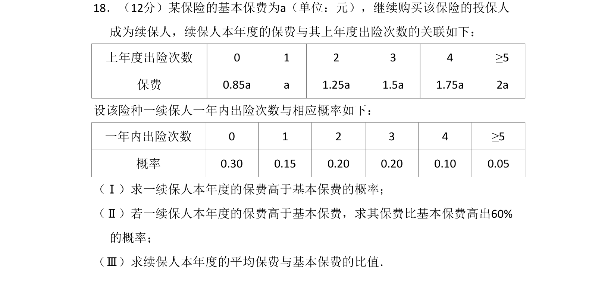
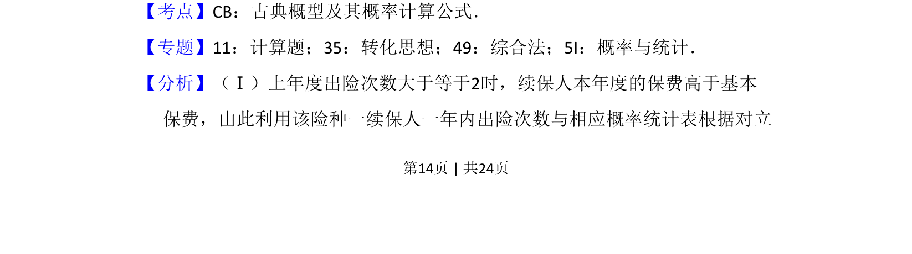
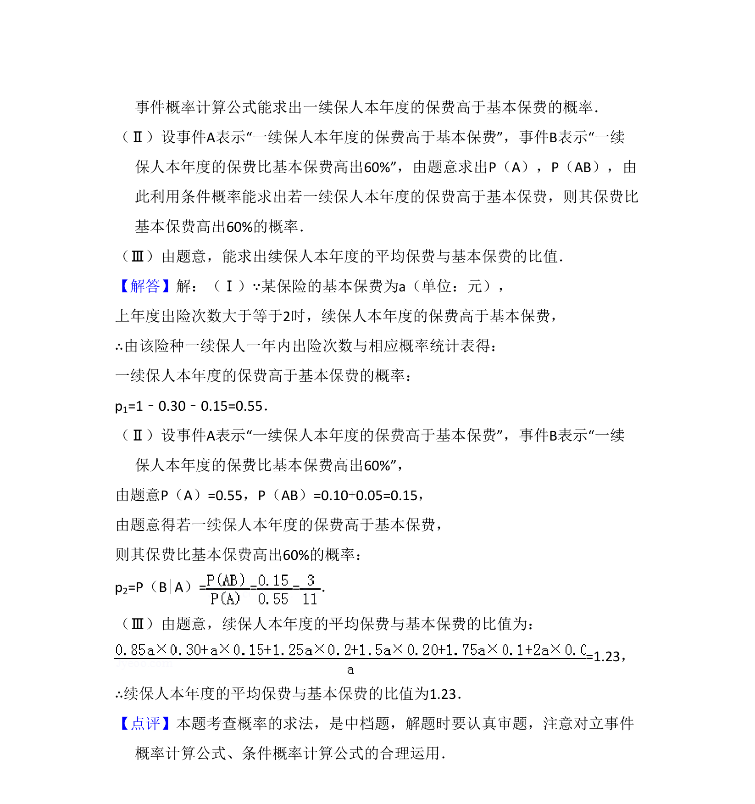

## 题面

## 摘要

一续保人保费高于基本保费的概率计算、条件概率及平均保费比值。

## 关联考点

- [[320-古典概型|古典概型]]
- [[340-条件概率初步|条件概率]]
- [[501-离散型随机变量期望|数学期望]]

## 答案与解析

> 📄 原 PDF 第 14 页：`素材/真题/吉林/2008-2024·（吉林）数学高考真题/2016年高考数学试卷（理）（新课标Ⅱ）（解析卷）.pdf`
