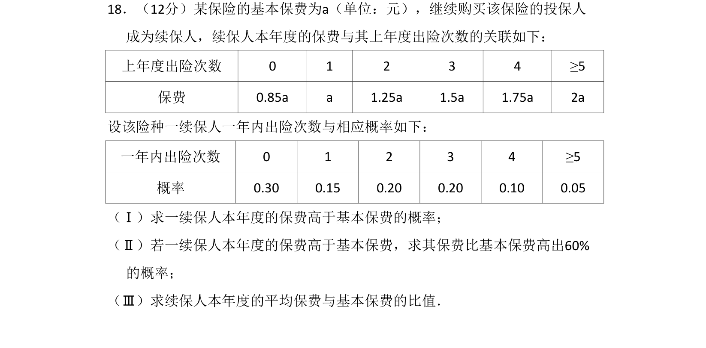
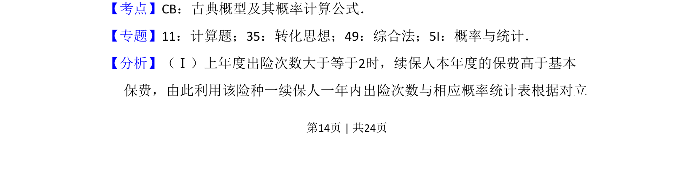
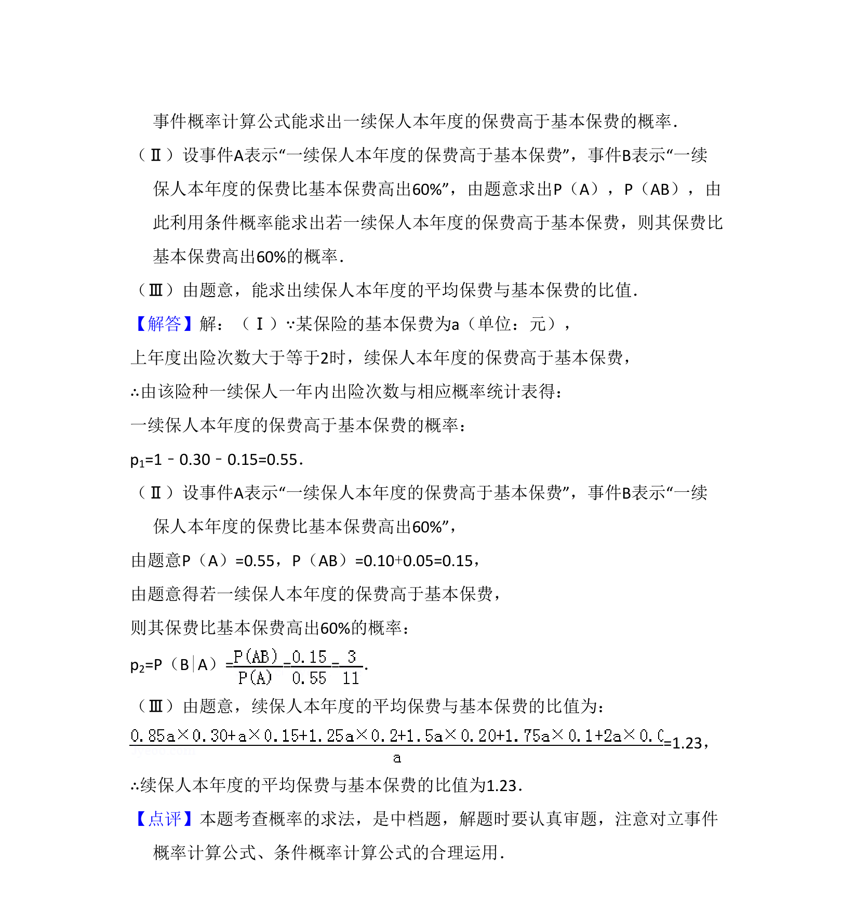

## 题面

## 摘要

一续保人保费高于基本保费的概率计算、条件概率及平均保费比值。

## 关联考点

- [[320-古典概型|古典概型]]
- [[340-条件概率初步|条件概率]]
- [[501-离散型随机变量期望|数学期望]]

## 答案与解析

> 📄 原 PDF 第 14 页：`素材/真题/吉林/2008-2024·（吉林）数学高考真题/2016年高考数学试卷（理）（新课标Ⅱ）（解析卷）.pdf`

<!-- 题干文本-start -->
## 题干文本
18．（12分）某保险的基本保费为a（单位：元），继续购买该保险的投保人
成为续保人，续保人本年度的保费与其上年度出险次数的关联如下：
上年度出险次数 0 1 2 3 4 ≥5
保费 0.85a a 1.25a 1.5a 1.75a 2a
设该险种一续保人一年内出险次数与相应概率如下：
一年内出险次数 0 1 2 3 4 ≥5
概率 0.30 0.15 0.20 0.20 0.10 0.05
（Ⅰ）求一续保人本年度的保费高于基本保费的概率；
（Ⅱ）若一续保人本年度的保费高于基本保费，求其保费比基本保费高出60%
的概率；
（Ⅲ）求续保人本年度的平均保费与基本保费的比值．
<!-- 题干文本-end -->

<!-- 解析文本-start -->
## 解析文本
【考点】CB：古典概型及其概率计算公式．菁优网版权所有
【专题】11：计算题；35：转化思想；49：综合法；5I：概率与统计．
【分析】（Ⅰ）上年度出险次数大于等于2时，续保人本年度的保费高于基本
保费，由此利用该险种一续保人一年内出险次数与相应概率统计表根据对立
<!-- 解析文本-end -->
