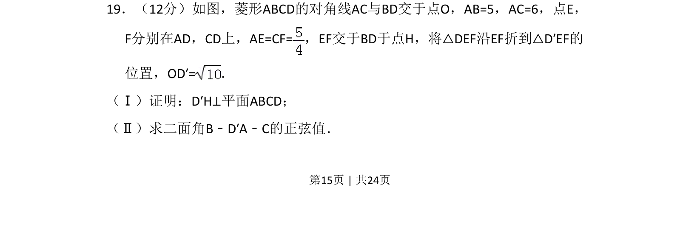
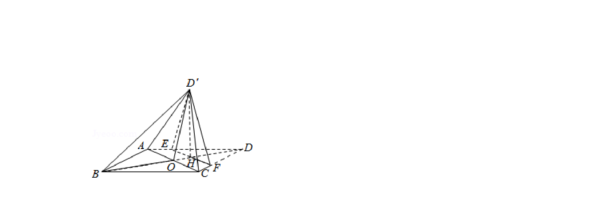
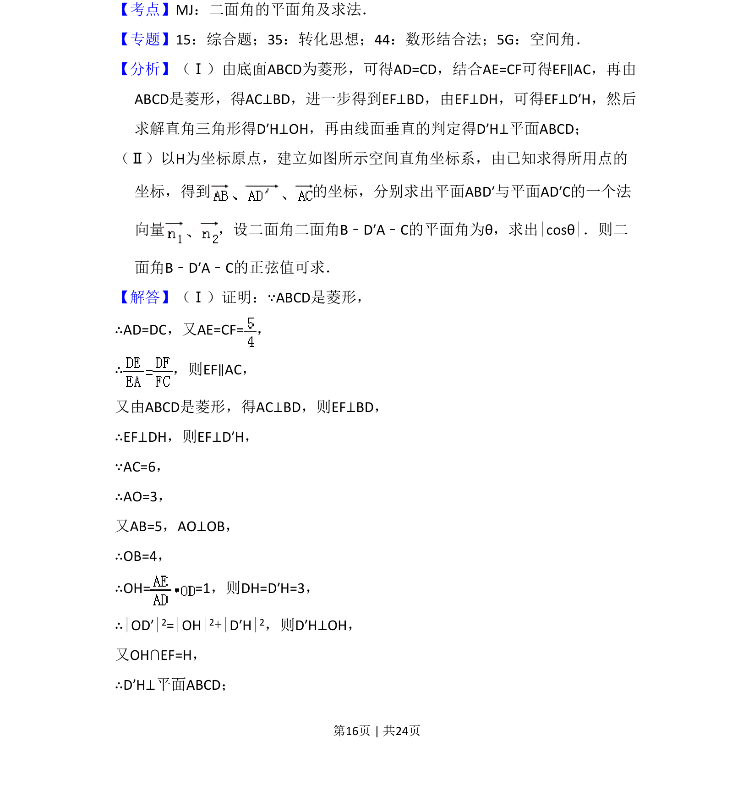
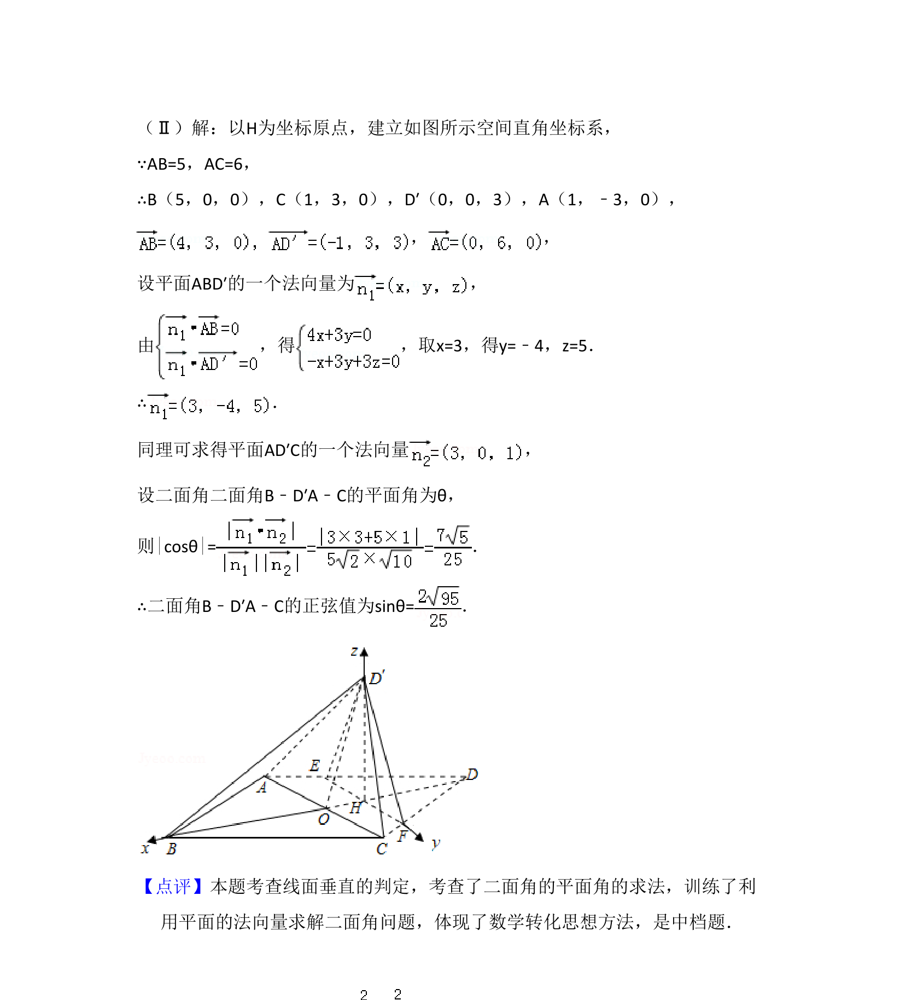

## 题面

## 摘要

本题为立体几何折叠问题，先证明线面垂直，再计算二面角的正弦值。

## 关联考点

- [[1086-线面垂直的判定|线面垂直的判定]]
- [[353-空间角|二面角]]
- [[579-空间向量法|空间向量法]]

## 答案与解析

> 📄 原 PDF 第 15 页：`素材/真题/吉林/2008-2024·（吉林）数学高考真题/2016年高考数学试卷（理）（新课标Ⅱ）（解析卷）.pdf`
