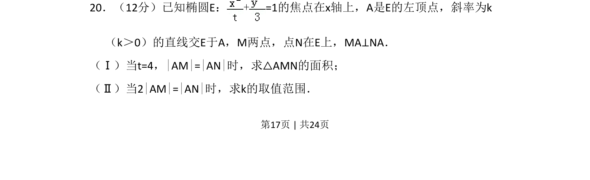
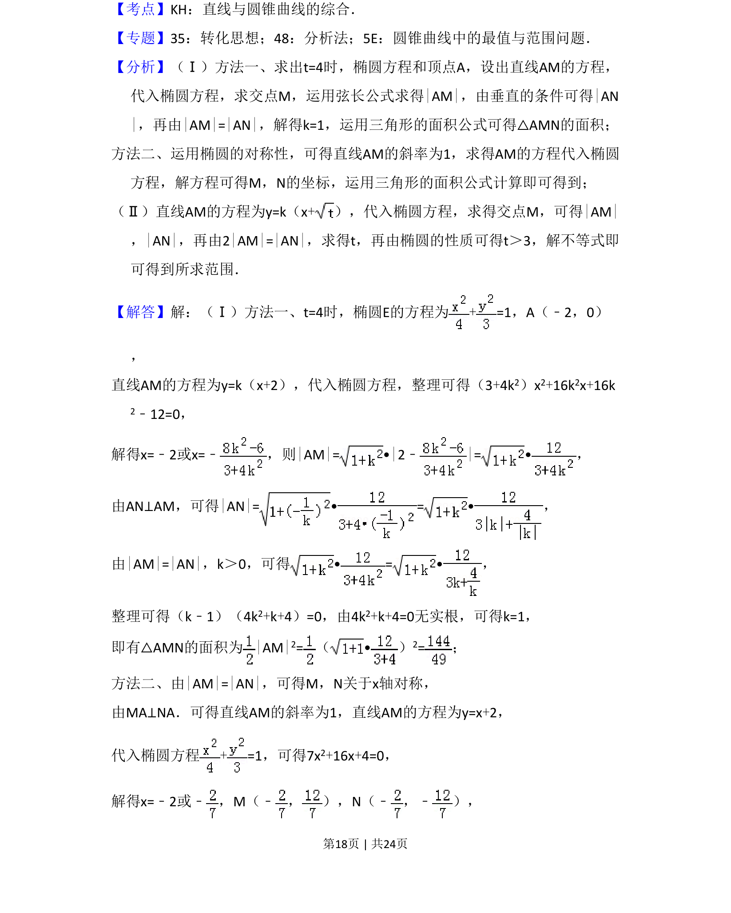
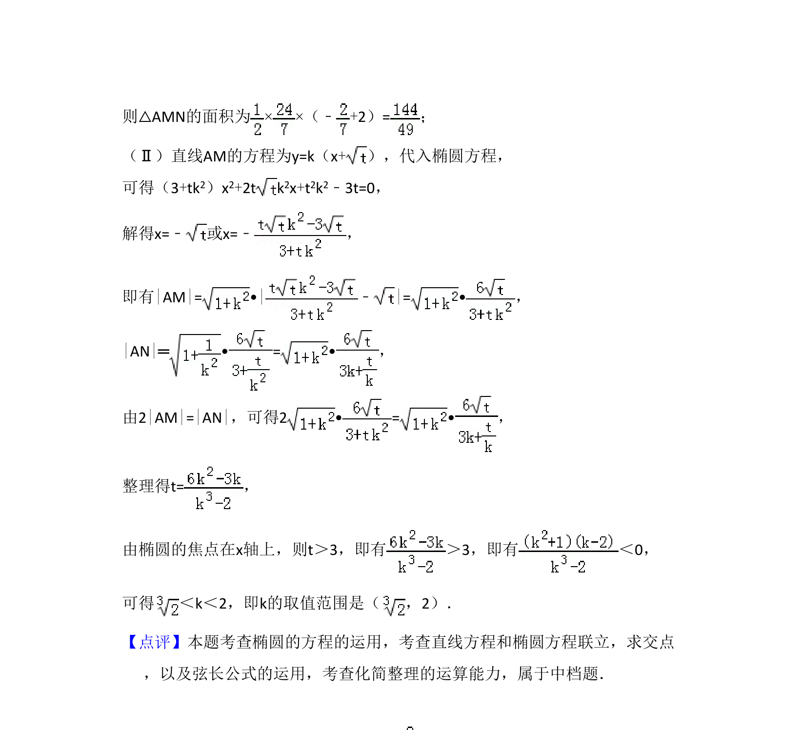

## 题面

## 摘要

椭圆中已知垂直与长度关系，求三角形面积及斜率取值范围

## 关联考点

- [[389-椭圆定义与方程|椭圆]]
- [[574-直线与圆锥曲线|直线与圆锥曲线]]
- [[791-垂直条件|垂直条件]]
- [[726-参数范围|参数范围]]

## 答案与解析

> 📄 原 PDF 第 17 页：`素材/真题/吉林/2008-2024·（吉林）数学高考真题/2016年高考数学试卷（理）（新课标Ⅱ）（解析卷）.pdf`
