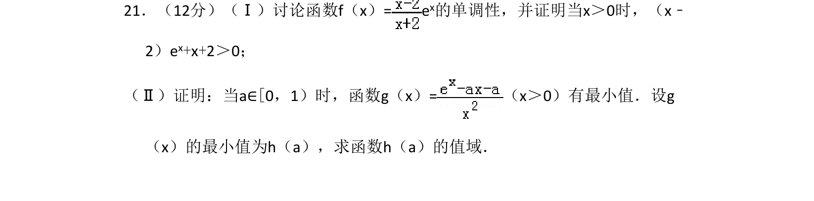
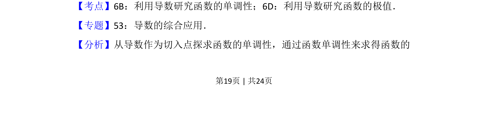
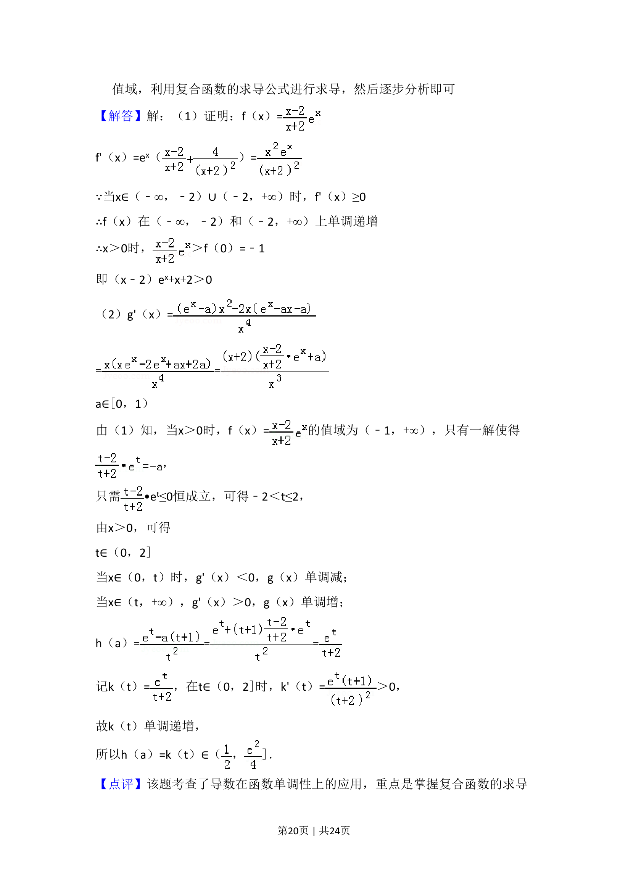
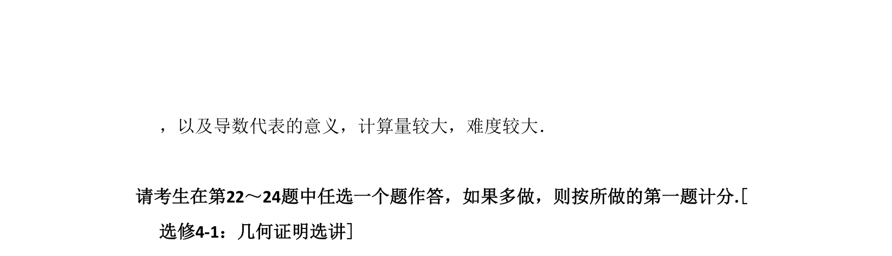

## 题面

## 摘要

通过导数讨论含参函数的单调性，证明不等式，并研究函数最小值及其值域。

## 关联考点

- [[705-利用导数研究函数的单调性|利用导数研究函数的单调性]]
- [[707-利用导数研究函数的极值|利用导数研究函数的极值]]
- [[676-函数值域|函数的值域]]

## 答案与解析

> 📄 原 PDF 第 19 页：`素材/真题/吉林/2008-2024·（吉林）数学高考真题/2016年高考数学试卷（理）（新课标Ⅱ）（解析卷）.pdf`

<!-- 题干文本-start -->
## 题干文本
21．（12分）（Ⅰ）讨论函数f（x）= e x的单调性，并证明当x＞0时，（x﹣
2）ex+x+2＞0；
（Ⅱ）证明：当a∈[0，1）时，函数g（x）=（x＞0）有最小值．设g
（x）的最小值为h（a），求函数h（a）的值域．
<!-- 题干文本-end -->

<!-- 解析文本-start -->
## 解析文本
【考点】6B：利用导数研究函数的单调性；6D：利用导数研究函数的极值．菁优网版权所有
【专题】53：导数的综合应用．
【分析】从导数作为切入点探求函数的单调性，通过函数单调性来求得函数的
<!-- 解析文本-end -->
