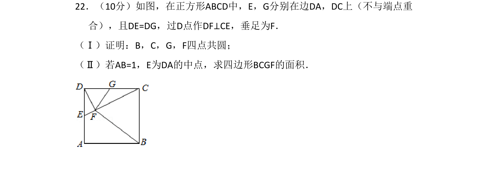
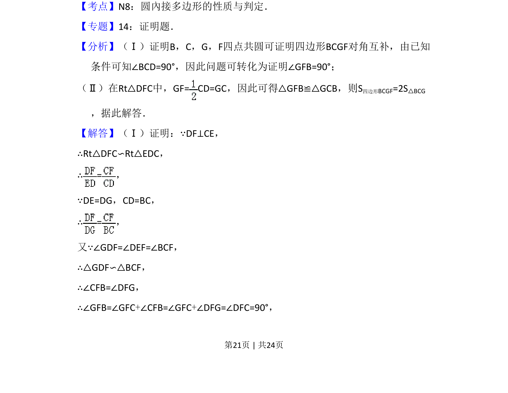
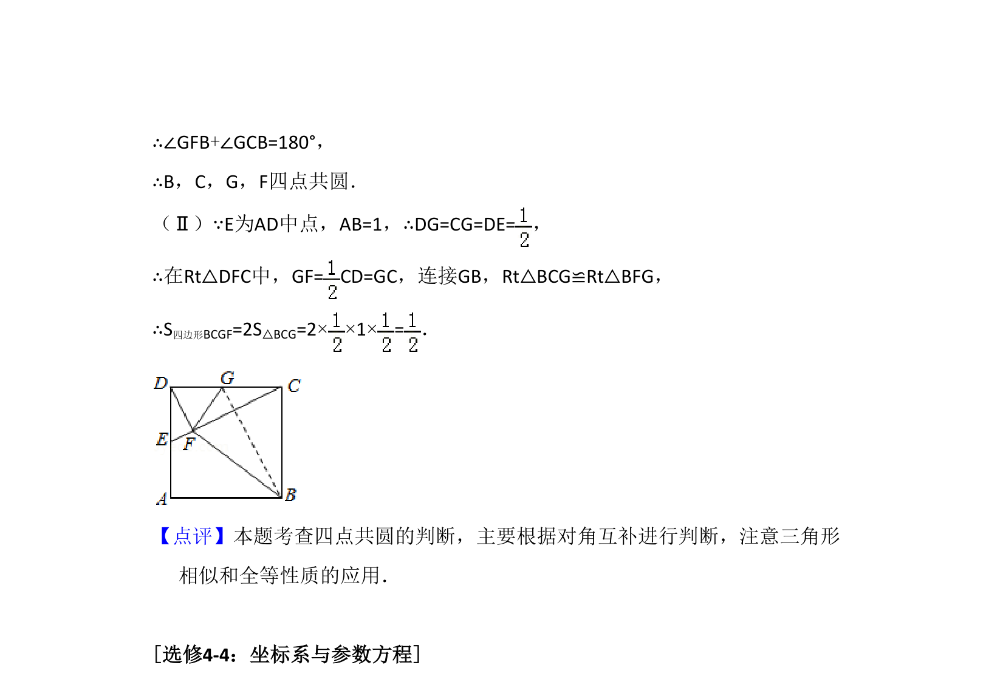

## 题面

## 摘要

考查正方形中四点共圆证明及四边形面积计算，涉及相似与全等三角形。

## 关联考点

- [[766-四点共圆|四点共圆]]
- [[1034-相似三角形|相似三角形]]
- [[152-全等三角形性质|全等三角形]]
- [[1147-面积计算|面积计算]]

## 答案与解析

> 📄 原 PDF 第 21 页：`素材/真题/吉林/2008-2024·（吉林）数学高考真题/2016年高考数学试卷（理）（新课标Ⅱ）（解析卷）.pdf`
