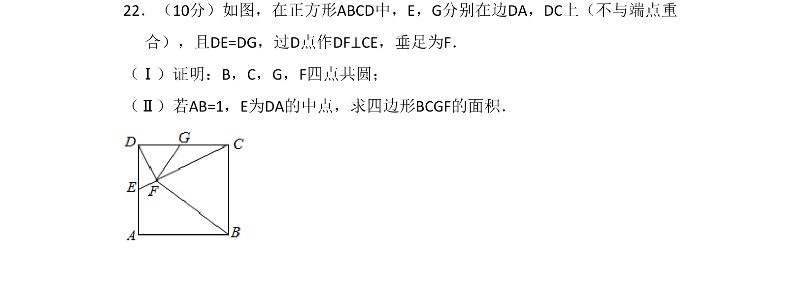
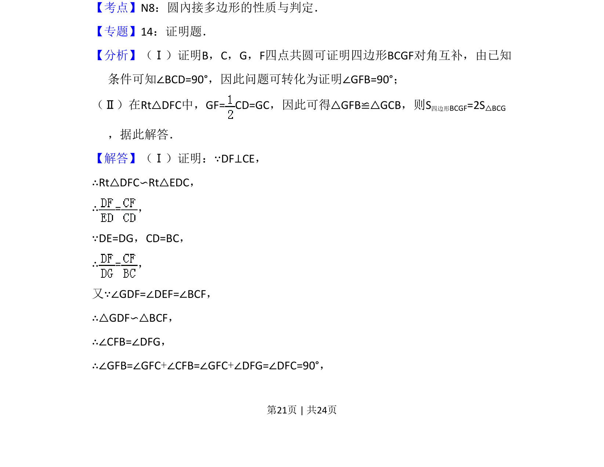
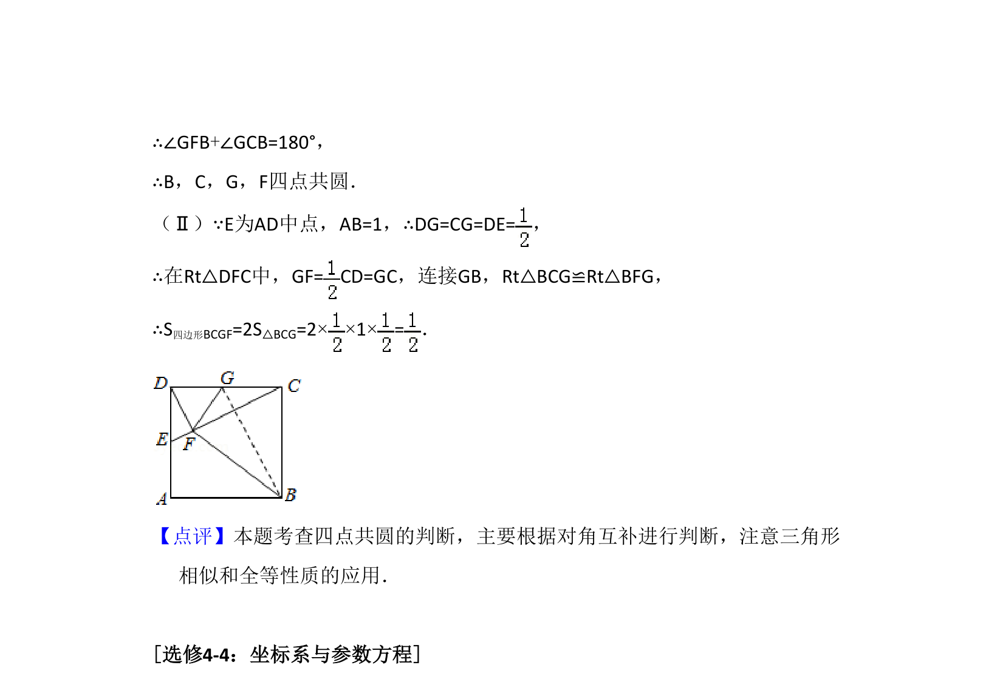

## 题面

## 摘要

考查正方形中四点共圆证明及四边形面积计算，涉及相似与全等三角形。

## 关联考点

- [[766-四点共圆|四点共圆]]
- [[1033-相似三角形|相似三角形]]
- [[152-全等三角形性质|全等三角形]]
- [[1146-面积计算|面积计算]]

## 答案与解析

> 📄 原 PDF 第 21 页：`素材/真题/吉林/2008-2024·（吉林）数学高考真题/2016年高考数学试卷（理）（新课标Ⅱ）（解析卷）.pdf`

<!-- 题干文本-start -->
## 题干文本
22．（10分）如图，在正方形ABCD中，E，G分别在边DA，DC上（不与端点重
合），且DE=DG，过D点作DF⊥CE，垂足为F．
（Ⅰ）证明：B，C，G，F四点共圆；
（Ⅱ）若AB=1，E为DA的中点，求四边形BCGF的面积．
<!-- 题干文本-end -->

<!-- 解析文本-start -->
## 解析文本
【考点】N8：圆內接多边形的性质与判定．菁优网版权所有
【专题】14：证明题．
【分析】（Ⅰ）证明B，C，G，F四点共圆可证明四边形BCGF对角互补，由已知
条件可知∠BCD=90°，因此问题可转化为证明∠GFB=90°；
（Ⅱ）在Rt△DFC中，GF= CD=GC，因此可得△GFB≌△GCB，则S 四边形BCGF=2S△BCG
，据此解答．
【解答】（Ⅰ）证明：∵DF⊥CE，
∴Rt△DFC∽Rt△EDC，
∴=，
∵DE=DG，CD=BC，
∴=，
又∵∠GDF=∠DEF=∠BCF，
∴△GDF∽△BCF，
∴∠CFB=∠DFG，
∴∠GFB=∠GFC+∠CFB=∠GFC+∠DFG=∠DFC=90°，
<!-- 解析文本-end -->
