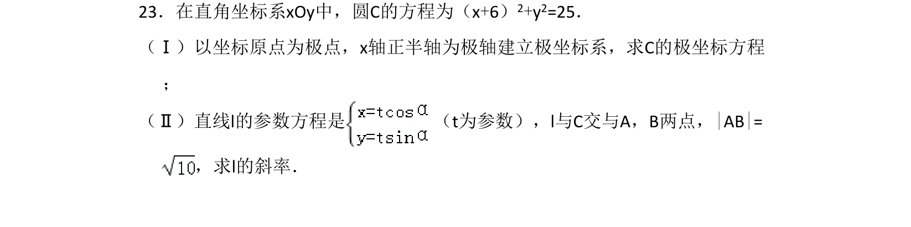
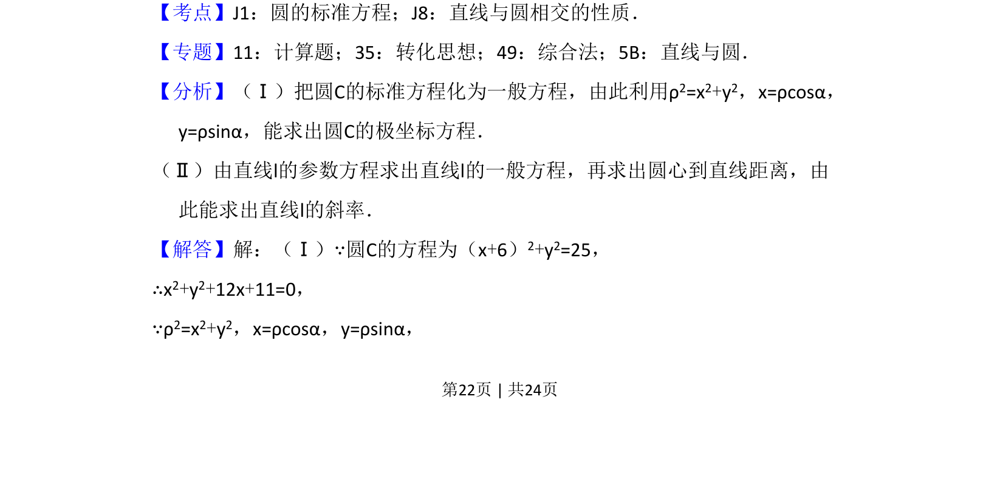

## 题面

## 摘要

本题要求将圆的直角坐标方程转化为极坐标方程，并利用直线参数方程与弦长求斜率。

## 关联考点

- [[极坐标方程]]
- [[直线与圆相交]]
- [[弦长]]
- [[393-直线倾斜角与斜率|斜率]]

## 答案与解析

> 📄 原 PDF 第 22 页：`素材/真题/吉林/2008-2024·（吉林）数学高考真题/2016年高考数学试卷（理）（新课标Ⅱ）（解析卷）.pdf`
