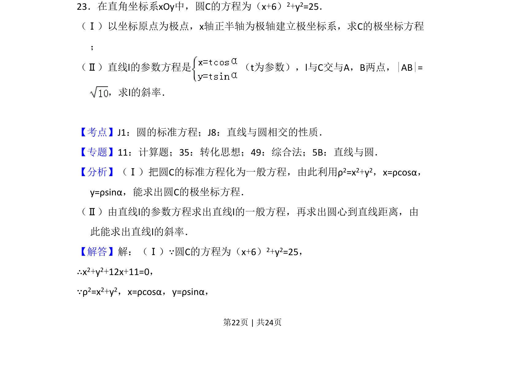
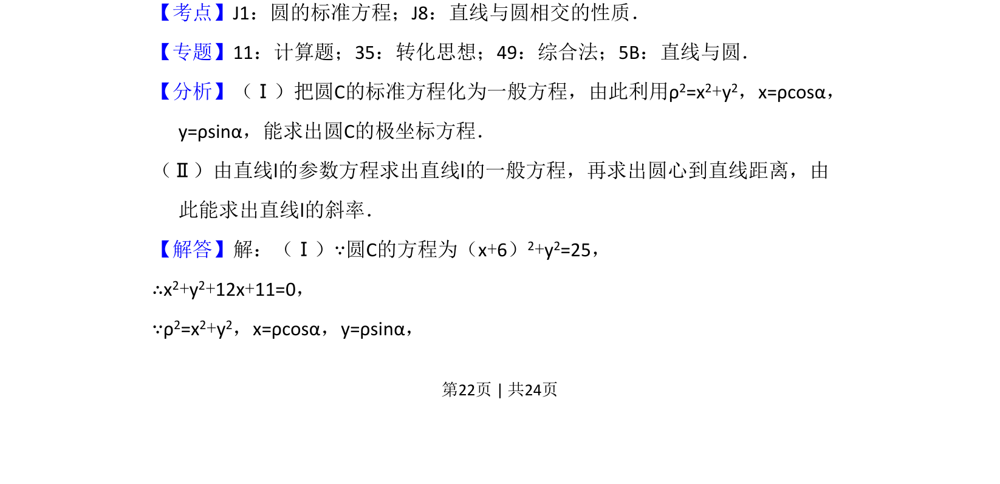
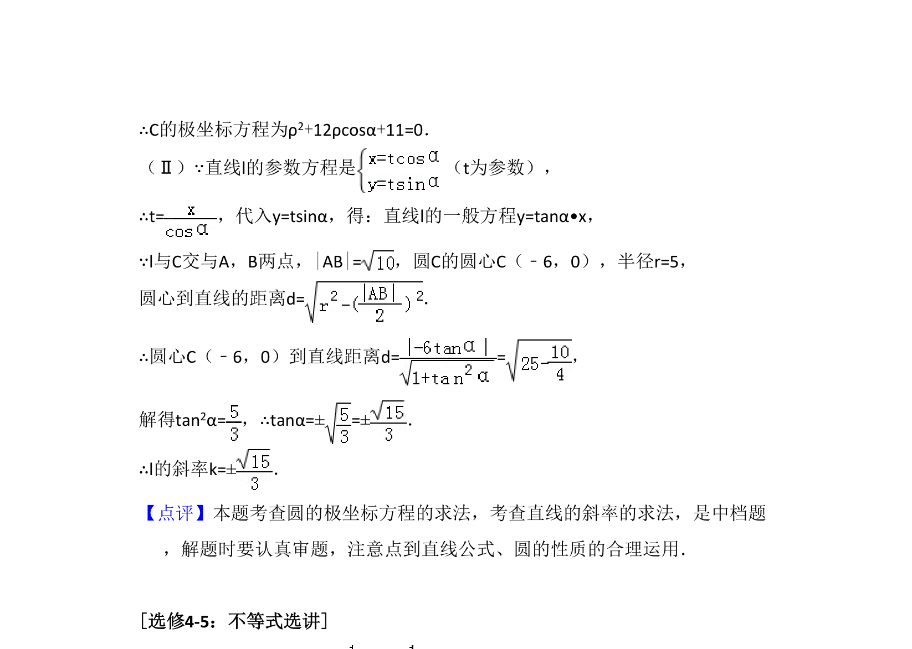

## 题面

## 摘要

本题要求将圆的直角坐标方程转化为极坐标方程，并利用直线参数方程与弦长求斜率。

## 关联考点

- [[921-极坐标方程|极坐标方程]]
- [[1218-直线与圆相交|直线与圆相交]]
- [[866-弦长|弦长]]
- [[393-直线倾斜角与斜率|斜率]]

## 答案与解析

> 📄 原 PDF 第 22 页：`素材/真题/吉林/2008-2024·（吉林）数学高考真题/2016年高考数学试卷（理）（新课标Ⅱ）（解析卷）.pdf`

<!-- 题干文本-start -->
## 题干文本
23．在直角坐标系xOy中，圆C的方程为（x+6）2+y2=25．
（Ⅰ）以坐标原点为极点，x轴正半轴为极轴建立极坐标系，求C的极坐标方程
；
（Ⅱ）直线l的参数方程是 （t为参数），l与C交与A，B两点，|AB|=
，求l的斜率．
<!-- 题干文本-end -->

<!-- 解析文本-start -->
## 解析文本
【考点】J1：圆的标准方程；J8：直线与圆相交的性质．菁优网版权所有
【专题】11：计算题；35：转化思想；49：综合法；5B：直线与圆．
【分析】（Ⅰ）把圆C的标准方程化为一般方程，由此利用ρ2=x2+y2，x=ρcosα，
y=ρsinα，能求出圆C的极坐标方程．
（Ⅱ）由直线l的参数方程求出直线l的一般方程，再求出圆心到直线距离，由
此能求出直线l的斜率．
【解答】解：（Ⅰ）∵圆C的方程为（x+6）2+y2=25，
∴x2+y2+12x+11=0，
∵ρ2=x2+y2，x=ρcosα，y=ρsinα，
<!-- 解析文本-end -->
