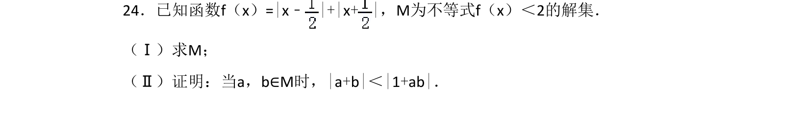
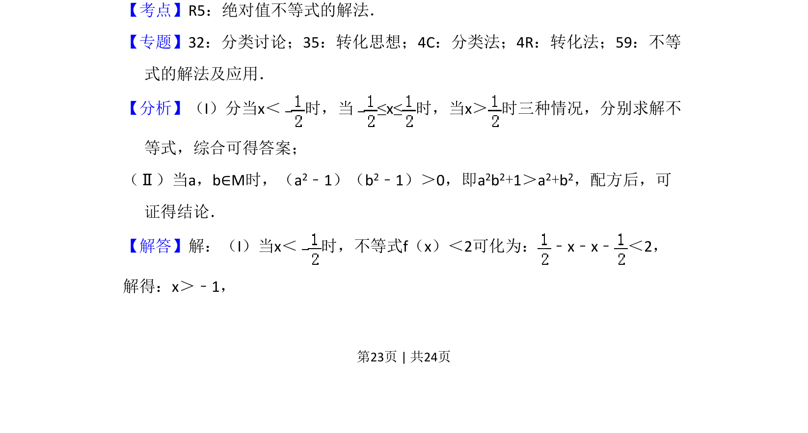
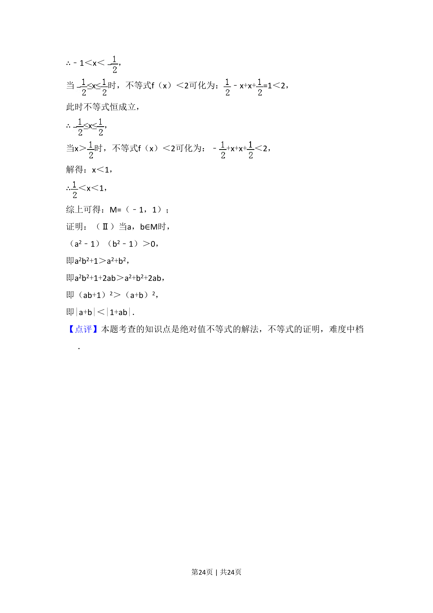

## 题面

## 摘要

求含绝对值不等式 f(x)=|x-1/2|+|x+1/2|≤6 的解集 M；并由 a,b∈M 证明 |a+b|<|1+ab|。

## 关联考点

- [[1093-绝对值不等式的解法|绝对值不等式解法]]
- [[424-参数分类讨论|分类讨论]]
- [[624-不等式的证明|不等式证明]]

## 答案与解析

> 📄 原 PDF 第 23 页：`素材/真题/吉林/2008-2024·（吉林）数学高考真题/2016年高考数学试卷（理）（新课标Ⅱ）（解析卷）.pdf`

<!-- 题干文本-start -->
## 题干文本
24．已知函数f（x）=|x﹣|+|x+ |，M为不等式f（x）＜2的解集．
（Ⅰ）求M；
（Ⅱ）证明：当a，b∈M时，|a+b|＜|1+ab|．
<!-- 题干文本-end -->

<!-- 解析文本-start -->
## 解析文本
【考点】R5：绝对值不等式的解法．菁优网版权所有
【专题】32：分类讨论；35：转化思想；4C：分类法；4R：转化法；59：不等
式的解法及应用．
【分析】（I）分当x＜ 时，当≤x≤时，当x＞ 时三种情况，分别求解不
等式，综合可得答案；
（Ⅱ）当a，b∈M时，（a2﹣1）（b2﹣1）＞0，即a2b2+1＞a2+b2，配方后，可
证得结论．
【解答】解：（I）当x＜ 时，不等式f（x）＜2可化为： ﹣x﹣x﹣ ＜2，
解得：x＞﹣1，
<!-- 解析文本-end -->
