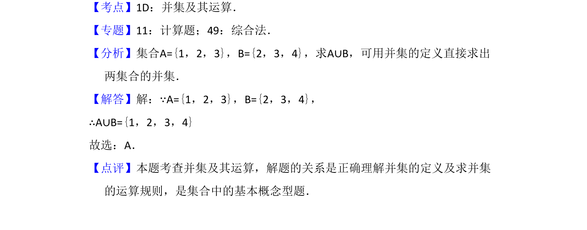

## 题面

## 摘要

考查集合并集的基本概念与简单运算，能根据定义直接求出两集合的并集。

## 关联考点

- [[860-并集运算|并集运算]]
- [[1138-集合基本概念|集合基本概念]]

## 答案与解析

> 📄 原 PDF 第 1 页：`素材/真题/吉林/2008-2024·（吉林）数学高考真题/2017年高考数学试卷（文）（新课标Ⅱ）（解析卷）.pdf`

<!-- 题干文本-start -->
## 题干文本
1．（5分）设集合A={1，2，3}，B={2，3，4}，则A∪B=（　　）
A．{1，2，3，4}B．{1，2，3}C．{2，3，4}D．{1，3，4}
<!-- 题干文本-end -->

<!-- 解析文本-start -->
## 解析文本
【考点】1D：并集及其运算．菁优网版权所有
【专题】11：计算题；49：综合法．
【分析】集合A={1，2，3}，B={2，3，4}，求A∪B，可用并集的定义直接求出
两集合的并集．
【解答】解：∵A={1，2，3}，B={2，3，4}，
∴A∪B={1，2，3，4}
故选：A．
【点评】本题考查并集及其运算，解题的关系是正确理解并集的定义及求并集
的运算规则，是集合中的基本概念型题．
<!-- 解析文本-end -->
