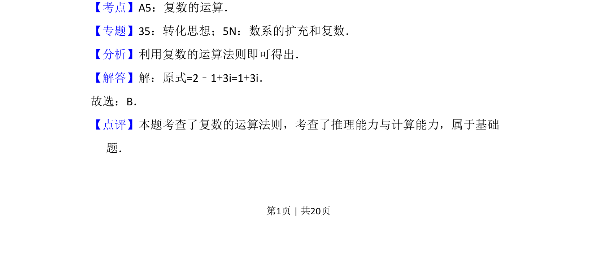

## 题面

## 摘要

本题考查复数的乘法运算及化简。

## 关联考点

- [[811-复数运算|复数运算]]
- [[332-复数的乘除运算|复数乘法]]

## 答案与解析

> 📄 原 PDF 第 1 页：`素材/真题/吉林/2008-2024·（吉林）数学高考真题/2017年高考数学试卷（文）（新课标Ⅱ）（解析卷）.pdf`

<!-- 题干文本-start -->
## 题干文本
2．（5分）（1+i）（2+i）=（　　）
A．1﹣i B．1+3i C．3+i D．3+3i
<!-- 题干文本-end -->

<!-- 解析文本-start -->
## 解析文本
【考点】A5：复数的运算．菁优网版权所有
【专题】35：转化思想；5N：数系的扩充和复数．
【分析】利用复数的运算法则即可得出．
【解答】解：原式=2﹣1+3i=1+3i．
故选：B．
【点评】本题考查了复数的运算法则，考查了推理能力与计算能力，属于基础
题．
<!-- 解析文本-end -->
