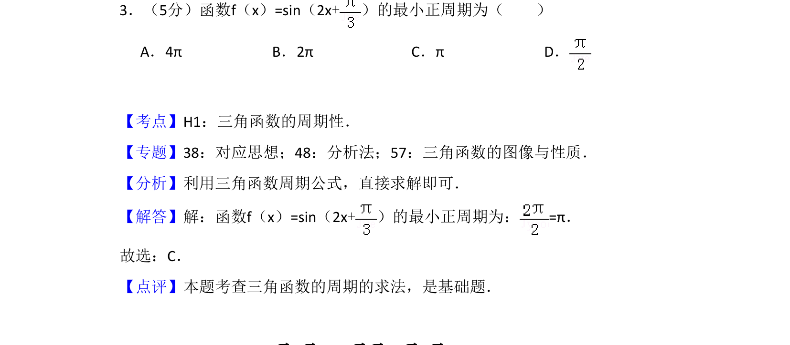
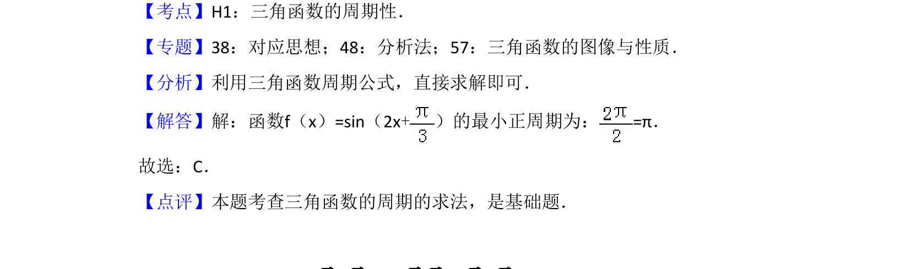

## 题面

## 摘要

该题考查三角函数的最小正周期计算，利用周期公式直接求解。

## 关联考点

- [[611-三角函数的周期性|三角函数的周期性]]
- [[759-周期公式|周期公式]]
- [[310-正弦函数图象与性质|正弦函数]]

## 答案与解析

> 📄 原 PDF 第 2 页：`素材/真题/吉林/2008-2024·（吉林）数学高考真题/2017年高考数学试卷（文）（新课标Ⅱ）（解析卷）.pdf`

<!-- 题干文本-start -->
## 题干文本
3．（5分）函数f（x）=sin（2x+）的最小正周期为（　　）
A．4πB．2πC．πD．
<!-- 题干文本-end -->

<!-- 解析文本-start -->
## 解析文本
【考点】H1：三角函数的周期性．菁优网版权所有
【专题】38：对应思想；48：分析法；57：三角函数的图像与性质．
【分析】利用三角函数周期公式，直接求解即可．
【解答】解：函数f（x）=sin（2x+）的最小正周期为：=π．
故选：C．
【点评】本题考查三角函数的周期的求法，是基础题．
<!-- 解析文本-end -->
