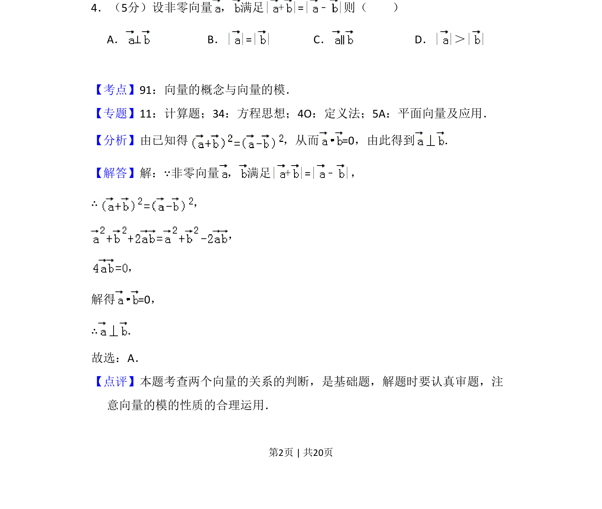
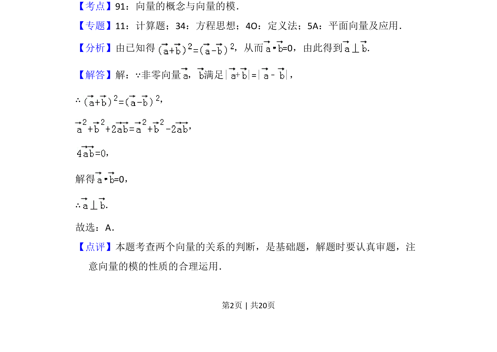

## 题面

## 摘要

本题通过向量模的等式条件推导两向量垂直关系。

## 关联考点

- [[752-向量模长|向量的模]]
- [[542-向量垂直|向量垂直]]
- [[328-向量的数量积|数量积]]

## 答案与解析

> 📄 原 PDF 第 2 页：`素材/真题/吉林/2008-2024·（吉林）数学高考真题/2017年高考数学试卷（文）（新课标Ⅱ）（解析卷）.pdf`
