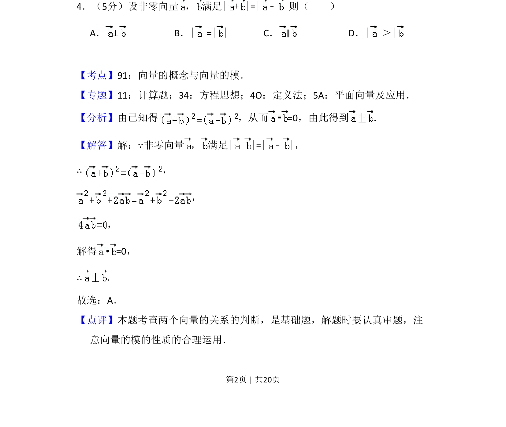
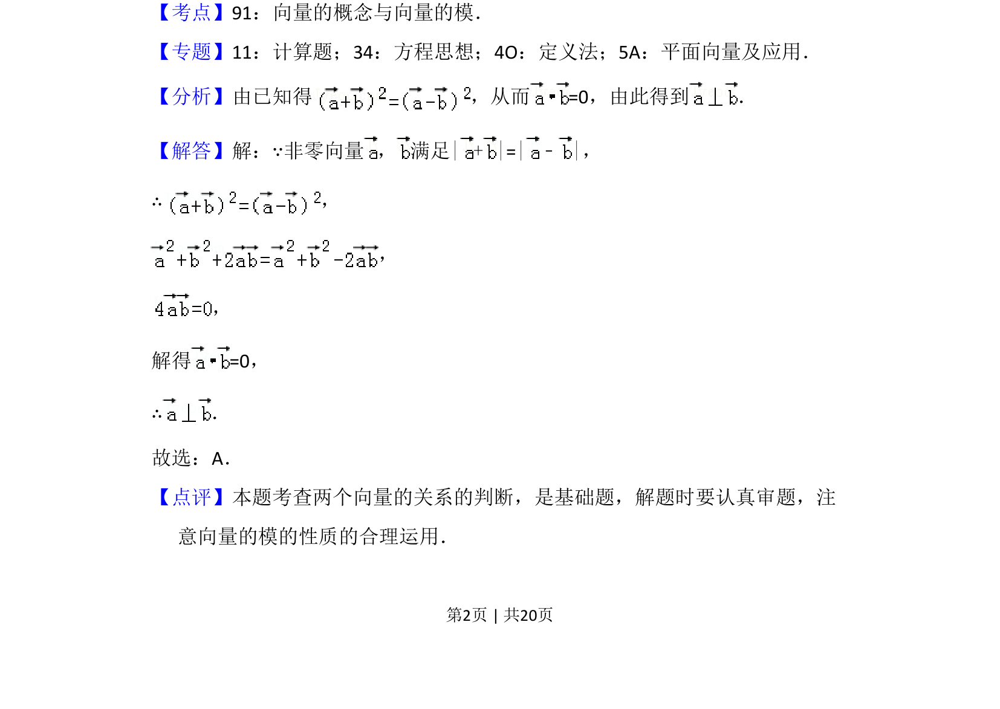

## 题面

## 摘要

本题通过向量模的等式条件推导两向量垂直关系。

## 关联考点

- [[752-向量模长|向量的模]]
- [[542-向量垂直|向量垂直]]
- [[328-向量的数量积|数量积]]

## 答案与解析

> 📄 原 PDF 第 2 页：`素材/真题/吉林/2008-2024·（吉林）数学高考真题/2017年高考数学试卷（文）（新课标Ⅱ）（解析卷）.pdf`

<!-- 题干文本-start -->
## 题干文本
4．（5分）设非零向量 ， 满足| + |=|﹣|则（　　）
A．⊥B．| |=| |C．∥D．| |＞| |
<!-- 题干文本-end -->

<!-- 解析文本-start -->
## 解析文本
【考点】91：向量的概念与向量的模．菁优网版权所有
【专题】11：计算题；34：方程思想；4O：定义法；5A：平面向量及应用．
【分析】由已知得 ，从而=0，由此得到 ．
【解答】解：∵非零向量 ， 满足| + |=|﹣|，
∴，
，
，
解得=0，
∴．
故选：A．
【点评】本题考查两个向量的关系的判断，是基础题，解题时要认真审题，注
意向量的模的性质的合理运用．
<!-- 解析文本-end -->
