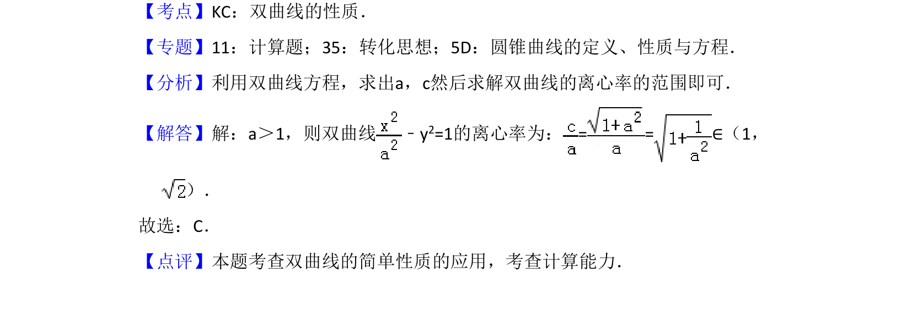

## 题面

## 摘要

已知双曲线方程及a>1，求离心率的取值范围

## 关联考点

- [[736-双曲线的离心率|双曲线的离心率]]
- [[676-函数值域|取值范围]]
- [[729-双曲线方程|双曲线方程]]

## 答案与解析

> 📄 原 PDF 第 3 页：`素材/真题/吉林/2008-2024·（吉林）数学高考真题/2017年高考数学试卷（文）（新课标Ⅱ）（解析卷）.pdf`

<!-- 题干文本-start -->
## 题干文本
5．（5分）若a＞1，则双曲线 ﹣y 2=1的离心率的取值范围是（　　）
A．（ ，+∞）B．（ ，2）C．（1， ）D．（1，2）
<!-- 题干文本-end -->

<!-- 解析文本-start -->
## 解析文本
【考点】KC：双曲线的性质．菁优网版权所有
【专题】11：计算题；35：转化思想；5D：圆锥曲线的定义、性质与方程．
【分析】利用双曲线方程，求出a，c然后求解双曲线的离心率的范围即可．
【解答】解：a＞1，则双曲线 ﹣y 2=1的离心率为：= =∈（1，
）．
故选：C．
【点评】本题考查双曲线的简单性质的应用，考查计算能力．
<!-- 解析文本-end -->
