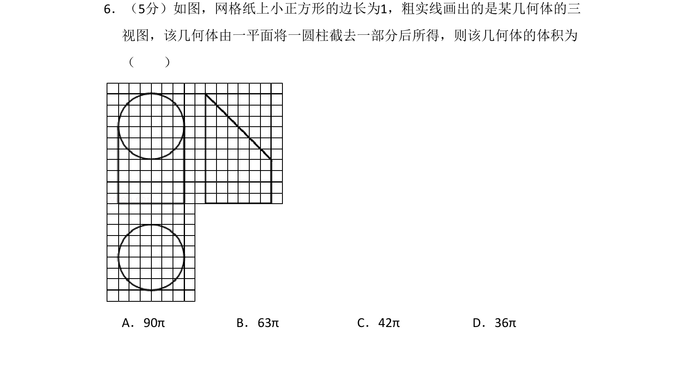
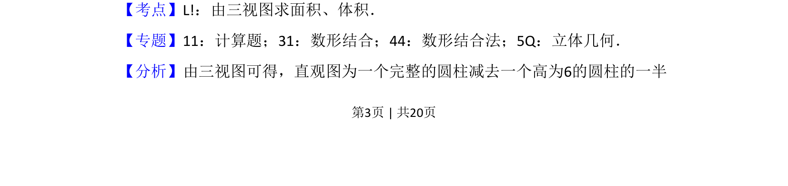
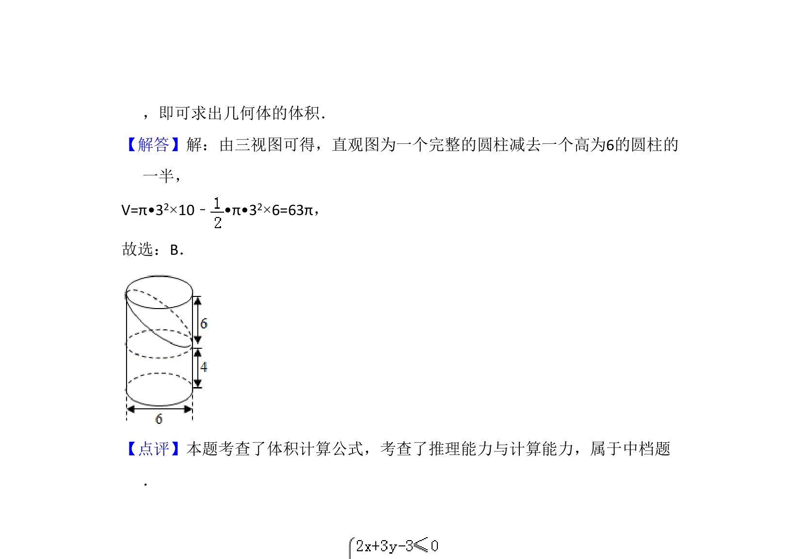

## 题面

## 摘要

通过三视图还原不规则几何体，该几何体为圆柱截去部分后的组合体，求其体积

## 关联考点

- [[996-由三视图求体积|由三视图求体积]]
- [[1046-空间几何体体积计算|空间几何体体积计算]]
- [[897-数形结合|数形结合]]

## 答案与解析

> 📄 原 PDF 第 3 页：`素材/真题/吉林/2008-2024·（吉林）数学高考真题/2017年高考数学试卷（文）（新课标Ⅱ）（解析卷）.pdf`
