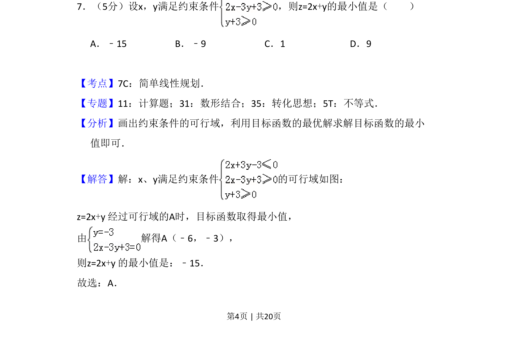
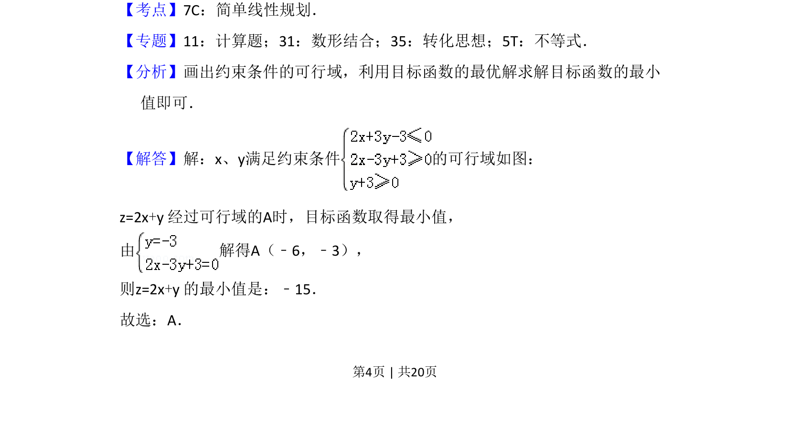
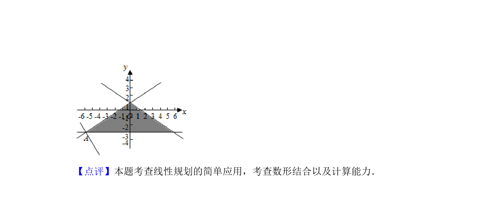

## 题面

## 摘要

该题考查二元一次不等式组表示的平面区域及线性目标函数的最小值求解。

## 关联考点

- [[1074-简单线性规划|简单线性规划]]
- [[1156-可行域|可行域]]
- [[1000-目标函数最值|目标函数最值]]

## 答案与解析

> 📄 原 PDF 第 4 页：`素材/真题/吉林/2008-2024·（吉林）数学高考真题/2017年高考数学试卷（文）（新课标Ⅱ）（解析卷）.pdf`

<!-- 题干文本-start -->
## 题干文本
7．（5分）设x，y满足约束条件 ，则z=2x+y的最小值是（　　）
A．﹣15 B．﹣9 C．1 D．9
<!-- 题干文本-end -->

<!-- 解析文本-start -->
## 解析文本
【考点】7C：简单线性规划．菁优网版权所有
【专题】11：计算题；31：数形结合；35：转化思想；5T：不等式．
【分析】画出约束条件的可行域，利用目标函数的最优解求解目标函数的最小
值即可．
【解答】解：x、y满足约束条件 的可行域如图：
z=2x+y 经过可行域的A时，目标函数取得最小值，
由 解得A（﹣6，﹣3），
则z=2x+y 的最小值是：﹣15．
故选：A．
<!-- 解析文本-end -->
