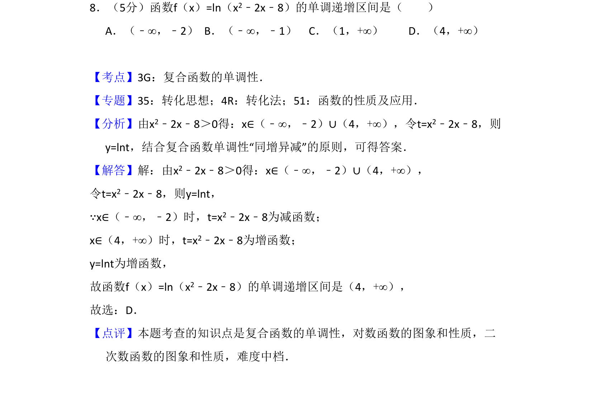
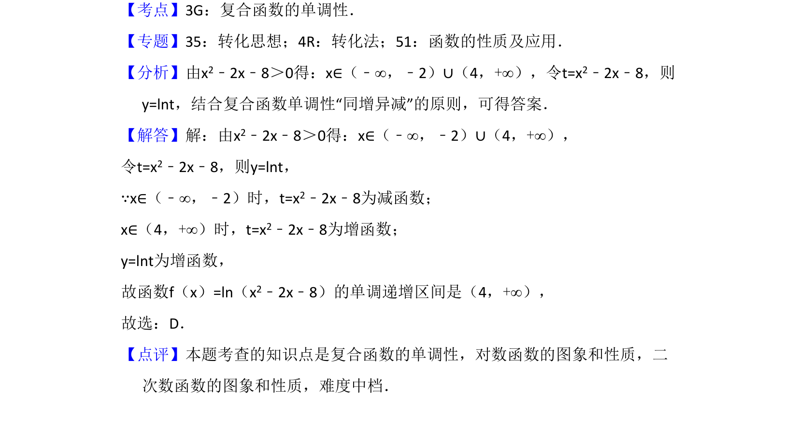

## 题面

## 摘要

本题考查复合函数单调区间的求解，需先求定义域，再利用“同增异减”原则判断。

## 关联考点

- [[复合函数的单调性]]
- [[299-对数函数的性质|对数函数的性质]]
- [[二次函数的性质]]

## 答案与解析

> 📄 原 PDF 第 5 页：`素材/真题/吉林/2008-2024·（吉林）数学高考真题/2017年高考数学试卷（文）（新课标Ⅱ）（解析卷）.pdf`
