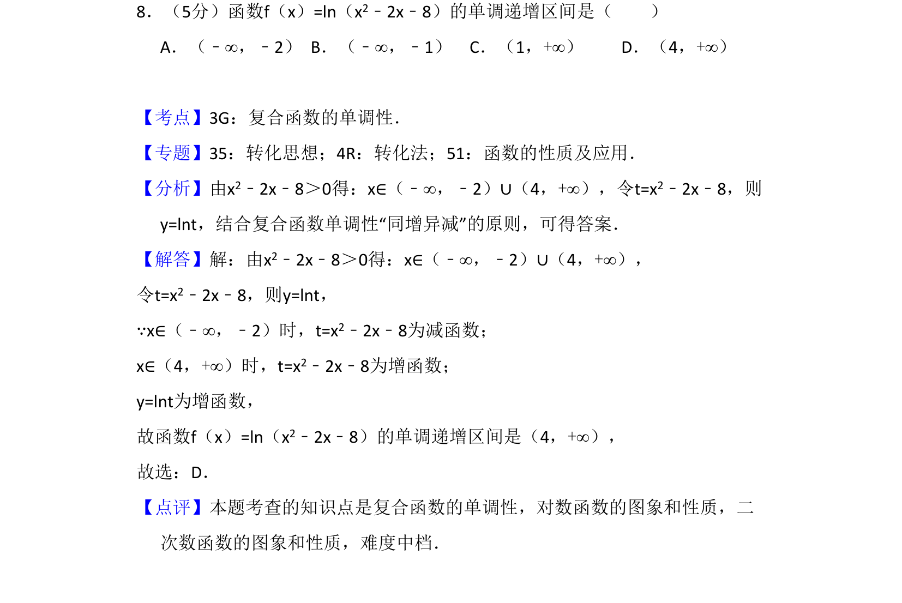
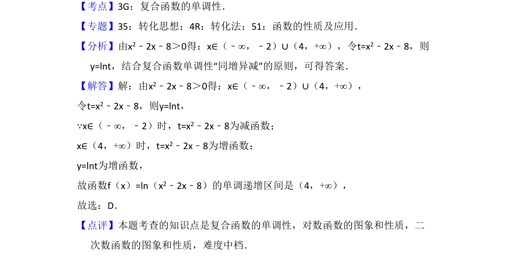

## 题面

## 摘要

本题考查复合函数单调区间的求解，需先求定义域，再利用“同增异减”原则判断。

## 关联考点

- [[796-复合函数的单调性|复合函数的单调性]]
- [[299-对数函数的性质|对数函数的性质]]
- [[641-二次函数的性质|二次函数的性质]]

## 答案与解析

> 📄 原 PDF 第 5 页：`素材/真题/吉林/2008-2024·（吉林）数学高考真题/2017年高考数学试卷（文）（新课标Ⅱ）（解析卷）.pdf`

<!-- 题干文本-start -->
## 题干文本
8．（5分）函数f（x）=ln（x2﹣2x﹣8）的单调递增区间是（　　）
A．（﹣∞，﹣2）B．（﹣∞，﹣1）C．（1，+∞）D．（4，+∞）
<!-- 题干文本-end -->

<!-- 解析文本-start -->
## 解析文本
【考点】3G：复合函数的单调性．菁优网版权所有
【专题】35：转化思想；4R：转化法；51：函数的性质及应用．
【分析】由x2﹣2x﹣8＞0得：x∈（﹣∞，﹣2）∪（4，+∞），令t=x2﹣2x﹣8，则
y=lnt，结合复合函数单调性“同增异减”的原则，可得答案．
【解答】解：由x2﹣2x﹣8＞0得：x∈（﹣∞，﹣2）∪（4，+∞），
令t=x2﹣2x﹣8，则y=lnt，
∵x∈（﹣∞，﹣2）时，t=x2﹣2x﹣8为减函数；
x∈（4，+∞）时，t=x2﹣2x﹣8为增函数；
y=lnt为增函数，
故函数f（x）=ln（x2﹣2x﹣8）的单调递增区间是（4，+∞），
故选：D．
【点评】本题考查的知识点是复合函数的单调性，对数函数的图象和性质，二
次数函数的图象和性质，难度中档．
<!-- 解析文本-end -->
