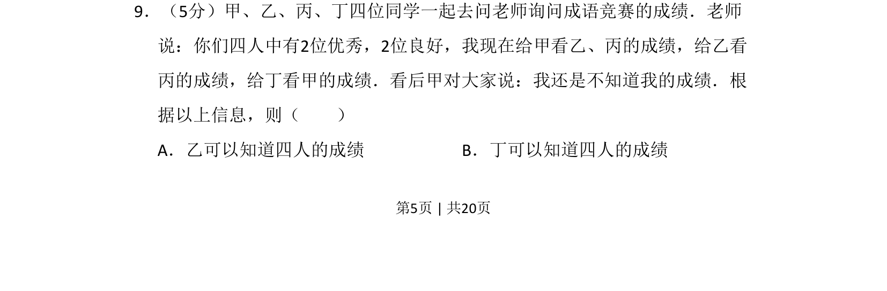
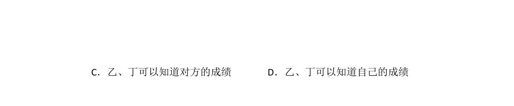
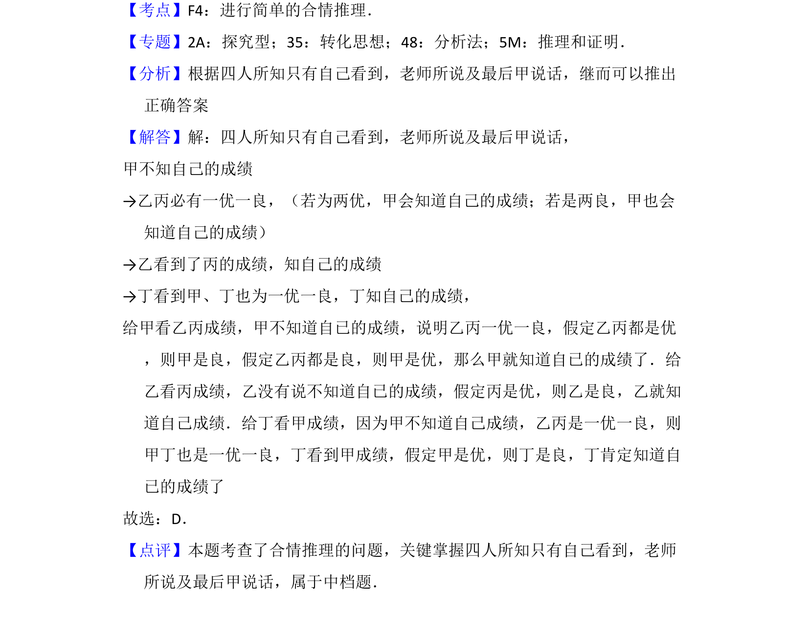

## 题面

## 摘要

本题通过老师给不同学生看成绩及甲的反应，推断谁能确定四人成绩。

## 关联考点

- [[037-推理|逻辑推理]]
- [[917-条件推理|条件推理]]
- [[656-信息推断|信息推断]]

## 答案与解析

> 📄 原 PDF 第 5 页：`素材/真题/吉林/2008-2024·（吉林）数学高考真题/2017年高考数学试卷（文）（新课标Ⅱ）（解析卷）.pdf`
