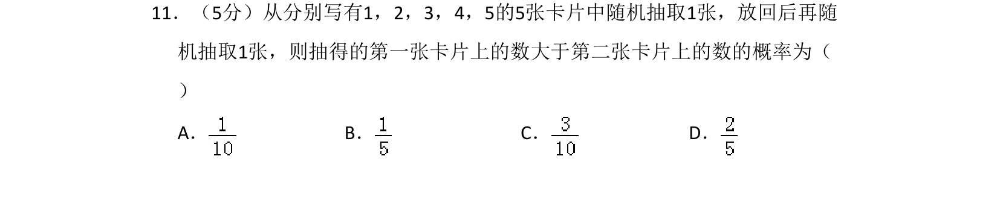
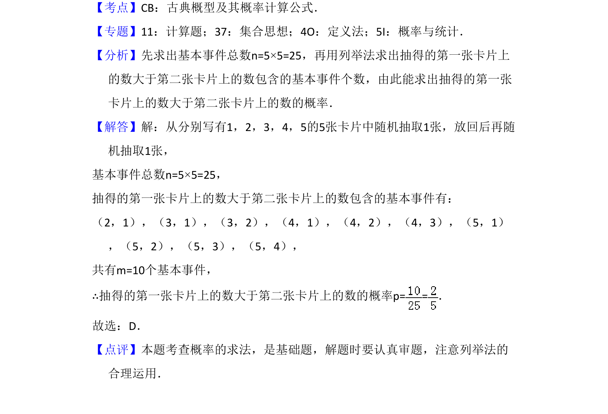

## 题面

## 摘要

从放回抽取的卡片中计算第一张数字大于第二张的概率，考查古典概型及列举法。

## 关联考点

- [[320-古典概型|古典概型]]
- [[948-概率计算|概率计算]]
- [[703-列举法|列举法]]

## 答案与解析

> 📄 原 PDF 第 8 页：`素材/真题/吉林/2008-2024·（吉林）数学高考真题/2017年高考数学试卷（文）（新课标Ⅱ）（解析卷）.pdf`

<!-- 题干文本-start -->
## 题干文本
11．（5分）从分别写有1，2，3，4，5的5张卡片中随机抽取1张，放回后再随
机抽取1张，则抽得的第一张卡片上的数大于第二张卡片上的数的概率为（　　
）
A．B．C．D．
<!-- 题干文本-end -->

<!-- 解析文本-start -->
## 解析文本
【考点】CB：古典概型及其概率计算公式．菁优网版权所有
【专题】11：计算题；37：集合思想；4O：定义法；5I：概率与统计．
【分析】先求出基本事件总数n=5×5=25，再用列举法求出抽得的第一张卡片上
的数大于第二张卡片上的数包含的基本事件个数，由此能求出抽得的第一张
卡片上的数大于第二张卡片上的数的概率．
【解答】解：从分别写有1，2，3，4，5的5张卡片中随机抽取1张，放回后再随
机抽取1张，
基本事件总数n=5×5=25，
抽得的第一张卡片上的数大于第二张卡片上的数包含的基本事件有：
（2，1），（3，1），（3，2），（4，1），（4，2），（4，3），（5，1）
，（5，2），（5，3），（5，4），
共有m=10个基本事件，
∴抽得的第一张卡片上的数大于第二张卡片上的数的概率p= =．
故选：D．
【点评】本题考查概率的求法，是基础题，解题时要认真审题，注意列举法的
合理运用．
<!-- 解析文本-end -->
