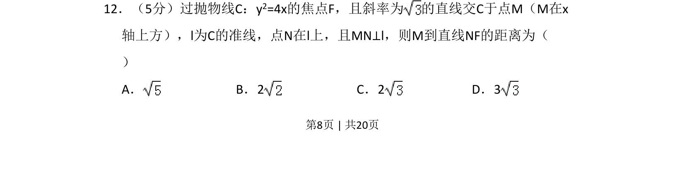
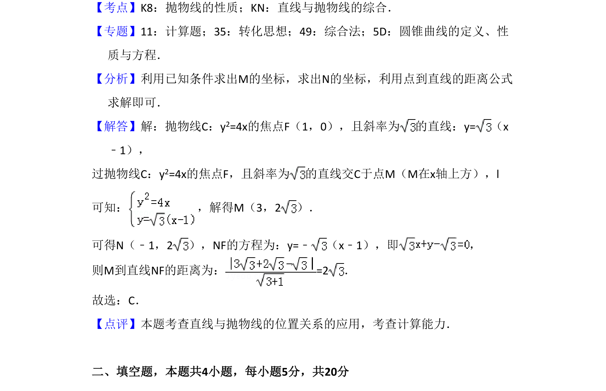

## 题面

## 摘要

本题考查抛物线焦点弦与准线构成的几何图形中点到直线的距离计算。

## 关联考点

- [[878-抛物线的几何性质|抛物线的几何性质]]
- [[981-点到直线的距离|点到直线的距离]]
- [[1027-直线方程|直线方程]]

## 答案与解析

> 📄 原 PDF 第 8 页：`素材/真题/吉林/2008-2024·（吉林）数学高考真题/2017年高考数学试卷（文）（新课标Ⅱ）（解析卷）.pdf`
