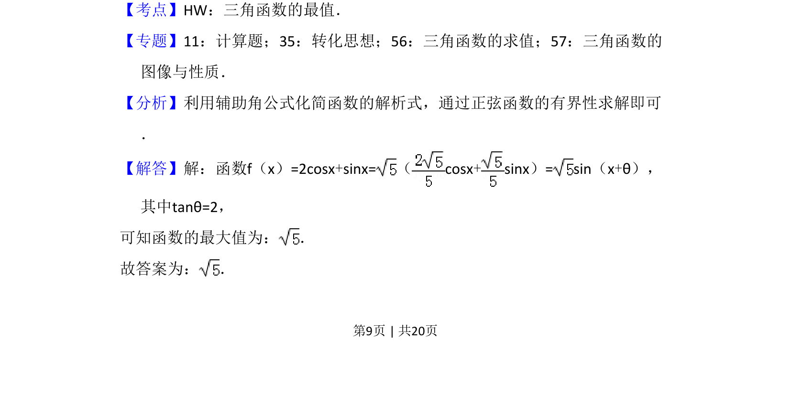
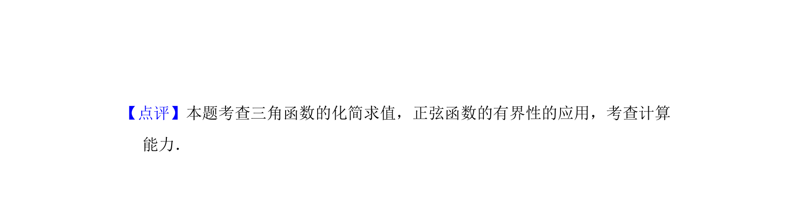

## 题面

## 摘要

利用辅助角公式将函数化为正弦型函数，进而求其最大值。

## 关联考点

- [[1126-辅助角公式|辅助角公式]]
- [[960-正弦函数有界性|正弦函数有界性]]
- [[615-三角函数的最值|三角函数最值]]

## 答案与解析

> 📄 原 PDF 第 9 页：`素材/真题/吉林/2008-2024·（吉林）数学高考真题/2017年高考数学试卷（文）（新课标Ⅱ）（解析卷）.pdf`

<!-- 题干文本-start -->
## 题干文本
13．（5分）函数f（x）=2cosx+sinx的最大值为　 　．
<!-- 题干文本-end -->

<!-- 解析文本-start -->
## 解析文本
【考点】HW：三角函数的最值．菁优网版权所有
【专题】11：计算题；35：转化思想；56：三角函数的求值；57：三角函数的
图像与性质．
【分析】利用辅助角公式化简函数的解析式，通过正弦函数的有界性求解即可
．
【解答】解：函数f（x）=2cosx+sinx=（cosx+sinx）= sin（x+θ），
其中tanθ=2，
可知函数的最大值为： ．
故答案为： ．
<!-- 解析文本-end -->
