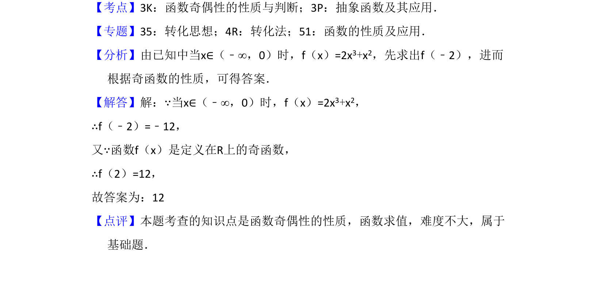

## 题面

## 摘要

已知奇函数在x<0时的解析式，利用奇偶性求f(2)的值。

## 关联考点

- [[284-函数的奇偶性|函数的奇偶性]]
- [[684-函数求值|函数求值]]

## 答案与解析

> 📄 原 PDF 第 10 页：`素材/真题/吉林/2008-2024·（吉林）数学高考真题/2017年高考数学试卷（文）（新课标Ⅱ）（解析卷）.pdf`

<!-- 题干文本-start -->
## 题干文本
14．（5分）已知函数f（x）是定义在R上的奇函数，当x∈（﹣∞，0）时，f（x
）=2x3+x2，则f（2）=　12　．
<!-- 题干文本-end -->

<!-- 解析文本-start -->
## 解析文本
【考点】3K：函数奇偶性的性质与判断；3P：抽象函数及其应用．菁优网版权所有
【专题】35：转化思想；4R：转化法；51：函数的性质及应用．
【分析】由已知中当x∈（﹣∞，0）时，f（x）=2x3+x2，先求出f（﹣2），进而
根据奇函数的性质，可得答案．
【解答】解：∵当x∈（﹣∞，0）时，f（x）=2x3+x2，
∴f（﹣2）=﹣12，
又∵函数f（x）是定义在R上的奇函数，
∴f（2）=12，
故答案为：12
【点评】本题考查的知识点是函数奇偶性的性质，函数求值，难度不大，属于
基础题．
<!-- 解析文本-end -->
