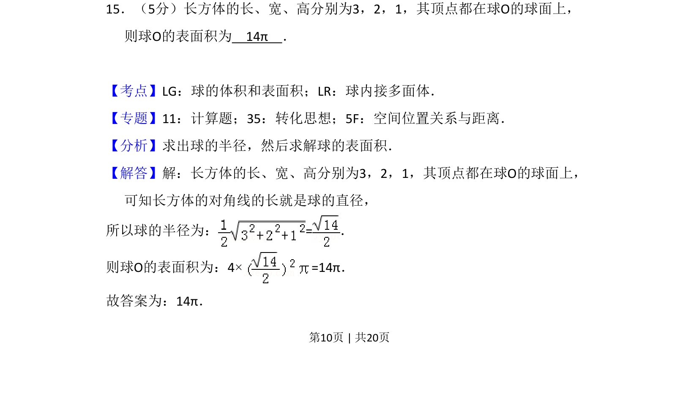
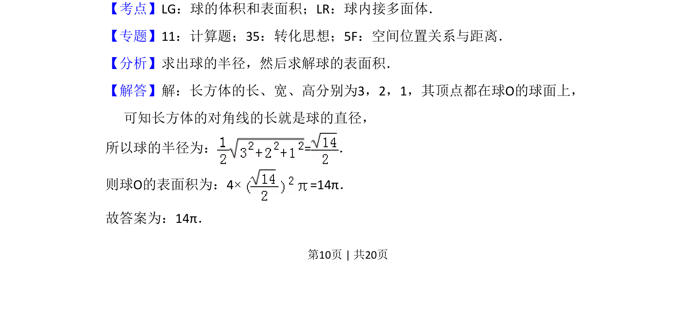
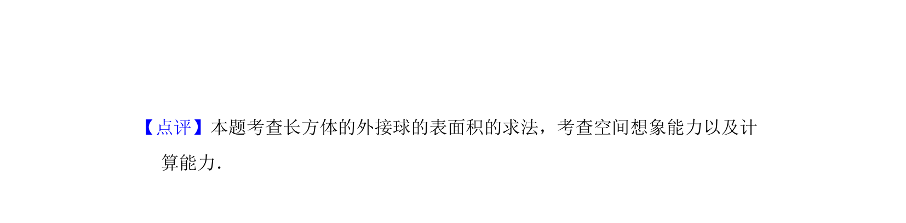

## 题面

## 摘要

长方体的顶点均在球面上，通过体对角线求球的半径，再计算球的表面积。

## 关联考点

- [[993-球的表面积|球的表面积]]
- [[988-球内接多面体|球内接多面体]]
- [[1131-长方体对角线|长方体对角线]]

## 答案与解析

> 📄 原 PDF 第 10 页：`素材/真题/吉林/2008-2024·（吉林）数学高考真题/2017年高考数学试卷（文）（新课标Ⅱ）（解析卷）.pdf`
