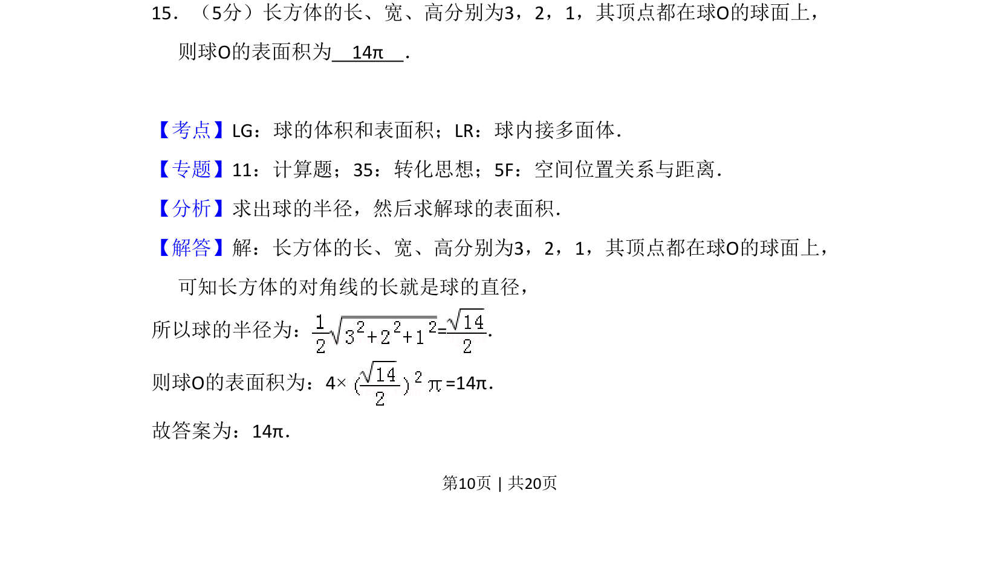
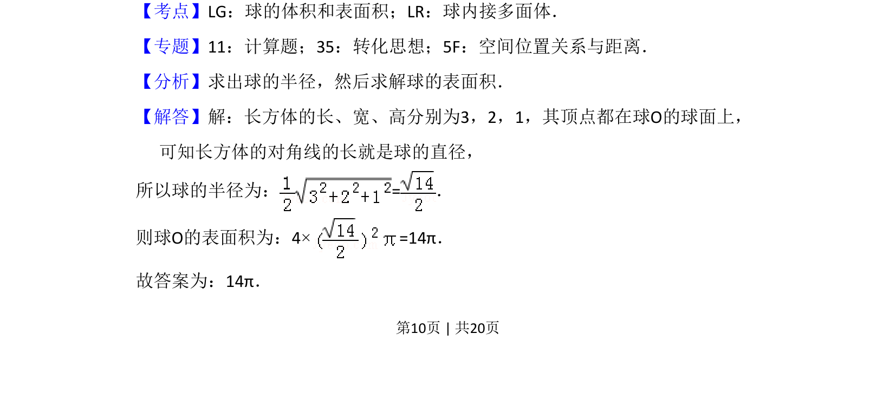
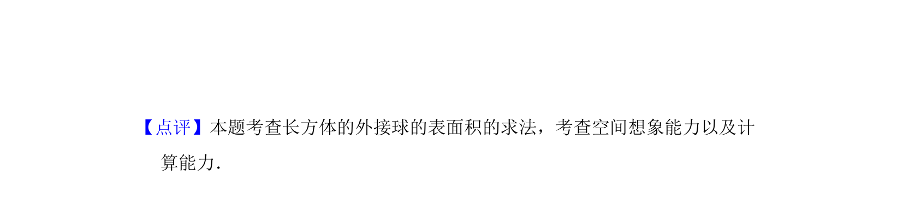

## 题面

## 摘要

长方体的顶点均在球面上，通过体对角线求球的半径，再计算球的表面积。

## 关联考点

- [[993-球的表面积|球的表面积]]
- [[988-球内接多面体|球内接多面体]]
- [[1131-长方体对角线|长方体对角线]]

## 答案与解析

> 📄 原 PDF 第 10 页：`素材/真题/吉林/2008-2024·（吉林）数学高考真题/2017年高考数学试卷（文）（新课标Ⅱ）（解析卷）.pdf`

<!-- 题干文本-start -->
## 题干文本
15．（5分）长方体的长、宽、高分别为3，2，1，其顶点都在球O的球面上，
则球O的表面积为　14π　．
<!-- 题干文本-end -->

<!-- 解析文本-start -->
## 解析文本
【考点】LG：球的体积和表面积；LR：球内接多面体．菁优网版权所有
【专题】11：计算题；35：转化思想；5F：空间位置关系与距离．
【分析】求出球的半径，然后求解球的表面积．
【解答】解：长方体的长、宽、高分别为3，2，1，其顶点都在球O的球面上，
可知长方体的对角线的长就是球的直径，
所以球的半径为：=．
则球O的表面积为：4×=14π．
故答案为：14π．
<!-- 解析文本-end -->
