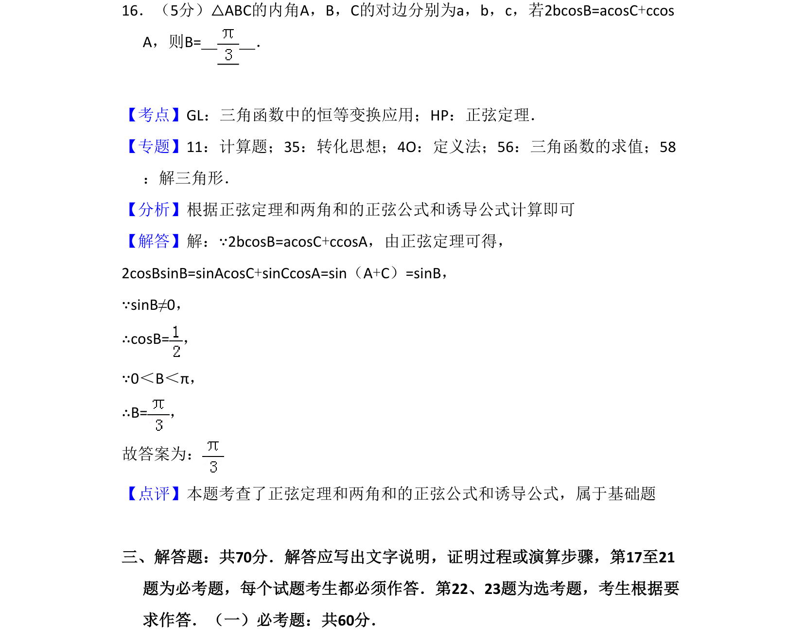
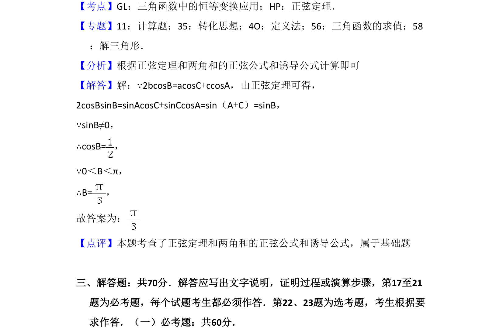

## 题面

## 摘要

本题考查利用正弦定理与三角恒等变换求解三角形内角，属于基础计算题。

## 关联考点

- [[126-定理|正弦定理]]
- [[634-两角和的正弦公式|两角和的正弦公式]]
- [[312-诱导公式|诱导公式]]
- [[589-解三角形|解三角形]]

## 答案与解析

> 📄 原 PDF 第 11 页：`素材/真题/吉林/2008-2024·（吉林）数学高考真题/2017年高考数学试卷（文）（新课标Ⅱ）（解析卷）.pdf`
