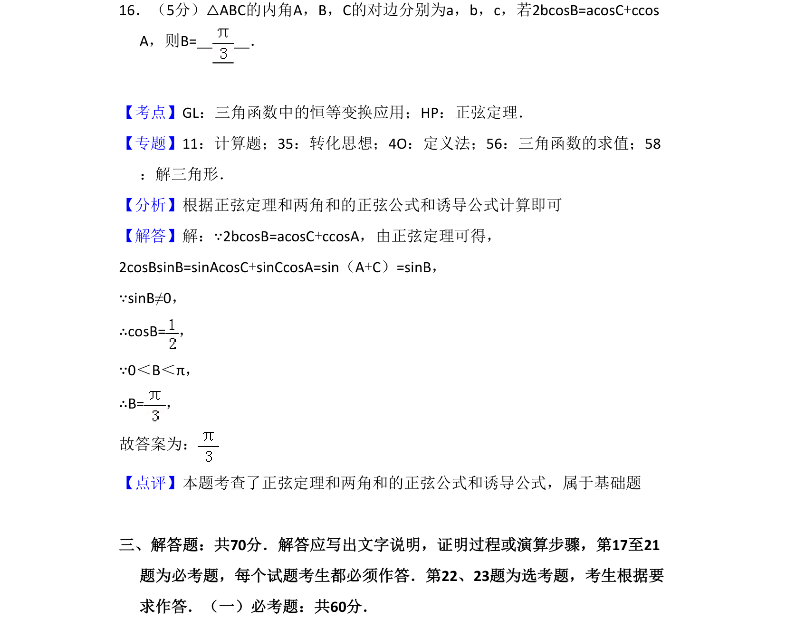
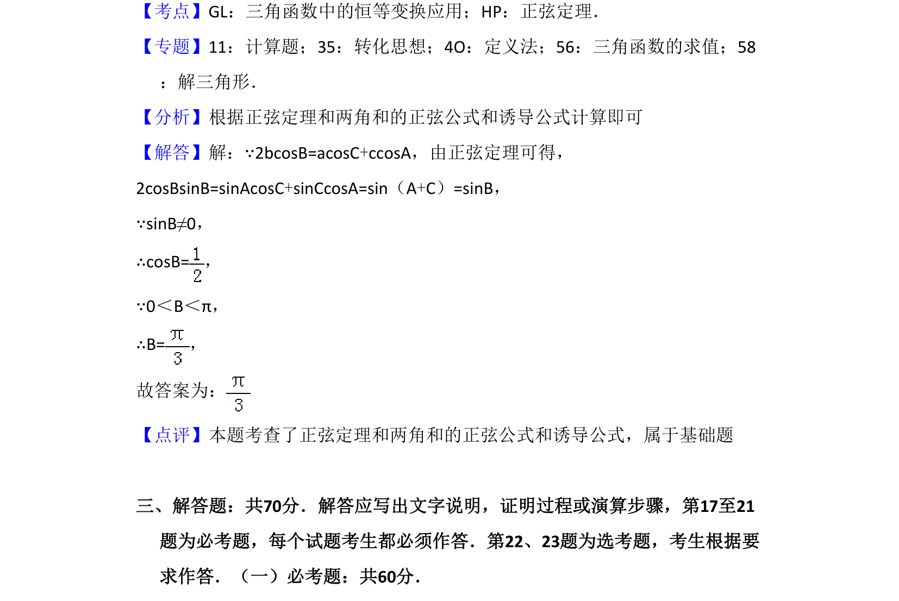

## 题面

## 摘要

本题考查利用正弦定理与三角恒等变换求解三角形内角，属于基础计算题。

## 关联考点

- [[126-定理|正弦定理]]
- [[634-两角和的正弦公式|两角和的正弦公式]]
- [[312-诱导公式|诱导公式]]
- [[589-解三角形|解三角形]]

## 答案与解析

> 📄 原 PDF 第 11 页：`素材/真题/吉林/2008-2024·（吉林）数学高考真题/2017年高考数学试卷（文）（新课标Ⅱ）（解析卷）.pdf`

<!-- 题干文本-start -->
## 题干文本
16．（5分）△ABC的内角A，B，C的对边分别为a，b，c，若2bcosB=acosC+ccos
A，则B=　 　．
<!-- 题干文本-end -->

<!-- 解析文本-start -->
## 解析文本
【考点】GL：三角函数中的恒等变换应用；HP：正弦定理．菁优网版权所有
【专题】11：计算题；35：转化思想；4O：定义法；56：三角函数的求值；58
：解三角形．
【分析】根据正弦定理和两角和的正弦公式和诱导公式计算即可
【解答】解：∵2bcosB=acosC+ccosA，由正弦定理可得，
2cosBsinB=sinAcosC+sinCcosA=sin（A+C）=sinB，
∵sinB≠0，
∴cosB=，
∵0＜B＜π，
∴B=，
故答案为：
【点评】本题考查了正弦定理和两角和的正弦公式和诱导公式，属于基础题
　
三、解答题：共70分．解答应写出文字说明，证明过程或演算步骤，第17至21
题为必考题，每个试题考生都必须作答．第22、23题为选考题，考生根据要
求作答．（一）必考题：共60分．
<!-- 解析文本-end -->
