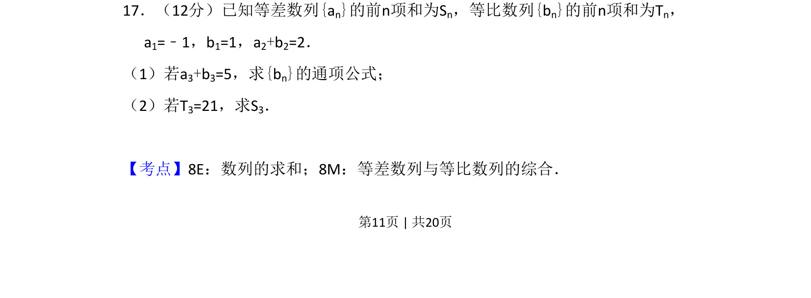

## 题面

## 摘要

本题考查等差数列与等比数列的通项公式及求和公式，通过条件列方程求解参数。

## 关联考点

- [[356-等差数列概念|等差数列]]
- [[358-等比数列概念|等比数列]]
- [[384-数列通项公式|通项公式]]
- [[求和]]

## 答案与解析

> 📄 原 PDF 第 11 页：`素材/真题/吉林/2008-2024·（吉林）数学高考真题/2017年高考数学试卷（文）（新课标Ⅱ）（解析卷）.pdf`
