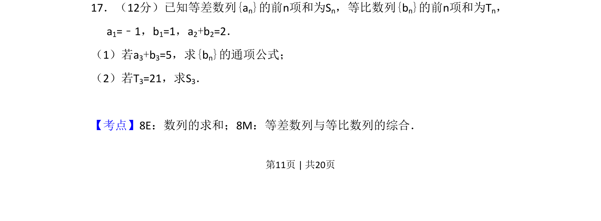
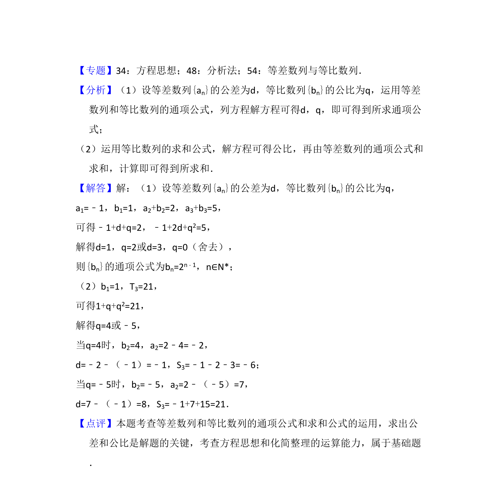

## 题面

## 摘要

本题考查等差数列与等比数列的通项公式及求和公式，通过条件列方程求解参数。

## 关联考点

- [[356-等差数列概念|等差数列]]
- [[358-等比数列概念|等比数列]]
- [[384-数列通项公式|通项公式]]
- [[569-求和|求和]]

## 答案与解析

> 📄 原 PDF 第 11 页：`素材/真题/吉林/2008-2024·（吉林）数学高考真题/2017年高考数学试卷（文）（新课标Ⅱ）（解析卷）.pdf`

<!-- 题干文本-start -->
## 题干文本
17．（12分）已知等差数列{an}的前n项和为Sn，等比数列{bn}的前n项和为Tn，
a1=﹣1，b1=1，a2+b2=2．
（1）若a3+b3=5，求{bn}的通项公式；
（2）若T3=21，求S3．
<!-- 题干文本-end -->

<!-- 解析文本-start -->
## 解析文本
【考点】8E：数列的求和；8M：等差数列与等比数列的综合．菁优网版权所有
<!-- 解析文本-end -->
